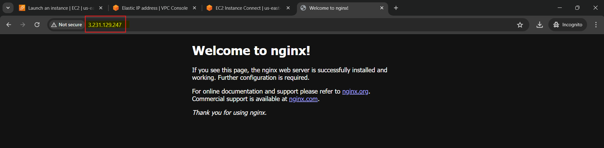

# Deploying K3s on AWS EC2

In this lab, we will deploy a k3s kubernetes cluster on aws EC2.


<!-- This documentation provides a comprehensive guide on how to deploy a K3s Kubernetes cluster on AWS EC2, including detailed explanations of the key concepts and terms involved. -->

<!-- ## Table of Contents

1. [Introduction to AWS EC2](#introduction-to-aws-ec2)
2. [Setting Up the EC2 Instance](#setting-up-the-ec2-instance)
3. [Allocating and Associating an Elastic IP](#allocating-and-associating-an-elastic-ip)
4. [Accessing the EC2 Instance via SSH](#accessing-the-ec2-instance-via-ssh)
5. [Installing K3s on AWS EC2](#installing-k3s-on-aws-ec2)
6. [Dockerizing Your Application](#dockerizing-your-application)
7. [Pushing the Docker Image to DockerHub](#pushing-the-docker-image-to-dockerhub)
8. [Creating a K3s Kubernetes Cluster](#creating-a-k3s-kubernetes-cluster)
9. [Deploying Your Application](#deploying-your-application) -->

## Introduction to AWS EC2

Amazon Elastic Compute Cloud (EC2) is a service that provides scalable computing capacity in the cloud. It allows users to rent virtual computers on which to run their own applications. EC2 instances are like virtual servers that can run different operating systems, depending on your preference.

## Setting Up the EC2 Instance

### Choosing an OS Distribution

For this guide, we will use an `Ubuntu` machine. Ubuntu is a popular Linux distribution known for its ease of use and extensive community support.

### Creating an EC2 Instance

1. **Launch an EC2 Instance**: Go to the AWS Management Console, navigate to the EC2 dashboard, and launch an instance.
2. **Select an AMI (Amazon Machine Image)**: Choose an Ubuntu AMI.
3. **Instance Type**: Select a free tier-eligible instance type such as `t2.micro` or `t3.micro`.
4. **Configure Instance**:
    - Configure security groups to allow HTTP (port 80) and HTTPS (port 443) traffic.
    - Create and assign an SSH key pair to securely access your instance.

### Launch the Instance

Review your settings and launch the instance. Once the instance is running, note the public IP address.

## Allocating and Associating an Elastic IP

Elastic IPs are static IP addresses designed for dynamic cloud computing. They allow your instance to maintain the same IP address even after it is stopped and started.

1. **Allocate an Elastic IP**:
    - Navigate to the Elastic IPs section in the EC2 dashboard.
    - Click "Allocate new address" and follow the prompts to create an Elastic IP.

2. **Associate the Elastic IP**:
    - Select the newly created Elastic IP.
    - Click "Actions" > "Associate Elastic IP address".
    - Choose your instance and private IP address to associate.

## Accessing the EC2 Instance via SSH

To set up K3s on your EC2 instance, you need to access it via SSH. There are two main ways to do this:

### Using SSH Key

1. **SSH Command**: Use the following command to connect to your instance:

    ```sh
    ssh -i path_to_your_key.pem ubuntu@your_instance_ip
    ```

### Using AWS EC2 Instance Connect

**EC2 Instance Connect**:
- Select your instance in the AWS console.
- Click "Connect" and choose "EC2 Instance Connect".
- Open the terminal in your browser to access the instance.

For simplification we will use the AWS EC2 Instance Connect. 

## Installing K3s on AWS EC2

K3s is a lightweight Kubernetes distribution designed for resource-constrained environments.

### Install K3s

1. **Run the Installation Command**:

    ```sh
    curl -sfL https://get.k3s.io | sh -s - --write-kubeconfig-mode 644
    ```

2. **Verify the Installation**:

    ```sh
    kubectl get nodes
    # Or
    kubectl cluster-info
    ```

## Dockerizing Your Application

Docker is a platform for developing, shipping, and running applications inside containers.

### Install Docker

1. **Update and Install Docker**:

    ```sh
    sudo apt update -y && sudo apt install docker.io -y
    ```

2. **Add User to Docker Group**:

    ```sh
    sudo usermod -aG docker $USER
    newgrp docker
    ```

### Create Application Directory and Files

1. **Create Directory and Index File**:

    ```sh
    mkdir k3s-app
    cd k3s-app
    echo "<h1>Welcome to K3s Kubernetes Cluster on AWS EC2</h1>" > index.html
    ```

### Create Dockerfile

1. **Dockerfile**:

    ```Dockerfile
    FROM nginx:alpine
    COPY . /usr/share/nginx/html
    ```

### Build and Run Docker Image

1. **Build Docker Image**:

    ```sh
    docker build -t your_dockerhub_username/k3s-app:latest .
    ```

2. **Run Docker Image**:

    ```sh
    docker run -d -p 3000:80 your_dockerhub_username/k3s-app:latest
    ```

3. **Update Security Group**: Ensure port 3000 is open in your security group settings.

4. **Access Application**: Open the application in your browser using `http://your_elastic_ip:3000/`.

<!-- ## Pushing the Docker Image to DockerHub

DockerHub is a cloud-based registry service that allows you to link to code repositories, build your images, and test them.

1. **Login to DockerHub**:

    ```sh
    docker login
    ```

2. **Push the Image**:

    ```sh
    docker push your_dockerhub_username/k3s-app:latest
    ``` -->

## Creating a K3s Kubernetes Cluster

To run your application on K3s, you need to create Kubernetes deployment and service files.

### Create Kubernetes Deployment File

1. **Create `k3s-app.yml`**:

    ```sh
    vi k3s-app.yml
    ```

2. **Add the following content**:

    ```yaml
    apiVersion: apps/v1
    kind: Deployment
    metadata:
      name: k3s-app
      labels:
        app: k3s-app
    spec:
      replicas: 1
      selector:
        matchLabels:
          app: k3s-app
      template:
        metadata:
          labels:
            app: k3s-app
        spec:
          containers:
            - name: k3s-app
              image: nginx:latest
              imagePullPolicy: Always
              ports:
                - containerPort: 80
    ---
    apiVersion: v1
    kind: Service
    metadata:
      labels:
        app: k3s-app-service
      name: k3s-app-service
    spec:
      ports:
        - name: "3000-80"
          port: 3000
          protocol: TCP
          targetPort: 80
      selector:
        app: k3s-app
      sessionAffinity: None
      type: ClusterIP
    status:
      loadBalancer: {}
    ---
    apiVersion: networking.k8s.io/v1
    kind: Ingress
    metadata:
      name: k3s-app-ingress
      annotations:
        ingress.kubernetes.io/ssl-redirect: "false"
    spec:
      rules:
        - http:
            paths:
              - path: /
                pathType: Prefix
                backend:
                  service:
                    name: k3s-app-service
                    port:
                      number: 3000
    ```

### Apply the Kubernetes Configuration

1. **Deploy to Kubernetes**:

    ```sh
    kubectl apply -f k3s-app.yml
    ```

2. **Verify Deployment**:

    ```sh
    kubectl get pods
    ```

## Deploying Your Application

To test the deployment, open your EC2 Elastic IP address in your browser. For example:

```sh
http://your_elastic_ip/
```

You should see your application running, indicating that the deployment was successful.



---

By following this documentation, you have successfully deployed a K3s Kubernetes cluster on AWS EC2 and run your application on it. This guide covers the setup of the EC2 instance, installation of K3s, Dockerizing and deploying an application, and configuring Kubernetes for production use.