# Deploying K3s on AWS EC2

In this lab, we will deploy a k3s kubernetes cluster on aws EC2.


<!-- This documentation provides a comprehensive guide on how to deploy a K3s Kubernetes cluster on AWS EC2, including detailed explanations of the key concepts and terms involved. -->

<!-- ## Table of Contents

1. [Introduction to AWS EC2](#introduction-to-aws-ec2)
2. [Setting Up the EC2 Instance](#setting-up-the-ec2-instance)
3. [Allocating and Associating an Elastic IP](#allocating-and-associating-an-elastic-ip)
4. [Accessing the EC2 Instance via SSH](#accessing-the-ec2-instance-via-ssh)
5. [Installing K3s on AWS EC2](#installing-k3s-on-aws-ec2)
6. [Dockerizing Your Application](#dockerizing-your-application)
7. [Pushing the Docker Image to DockerHub](#pushing-the-docker-image-to-dockerhub)
8. [Creating a K3s Kubernetes Cluster](#creating-a-k3s-kubernetes-cluster)
9. [Deploying Your Application](#deploying-your-application) -->

## Introduction to AWS EC2

Amazon Elastic Compute Cloud (EC2) is a service that provides scalable computing capacity in the cloud. It allows users to rent virtual computers on which to run their own applications. EC2 instances are like virtual servers that can run different operating systems, depending on your preference.

## Setting Up the VPC
<details>
  <summary>Click to expand</summary>

# AWS VPC Setup Documentation

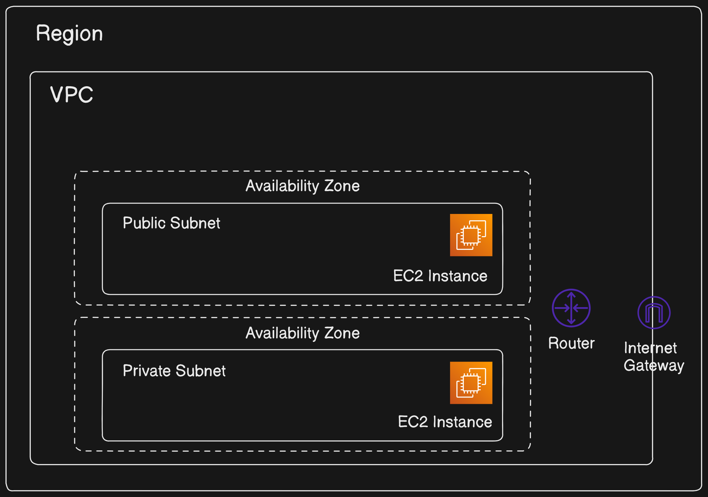

### Step 1: Create Your VPC
1. **Open the AWS Management Console** and search for "VPC" in the search bar.
2. On the left-hand side, click on "Your VPCs".
3. Click on "Create VPC" at the top right corner.

   

4. Name your VPC using a tag.
5. Set the IPv4 CIDR block to `10.0.0.0/16`.

   Congratulations on creating your first VPC!

### Step 2: Create a Public Subnet
1. After creating your VPC, click on "Subnets" on the left-hand side.
2. Click on "Create Subnet".

   
   

3. Designate the VPC you just created.
4. Assign a CIDR block within your VPC’s range (e.g., `10.0.1.0/24`).
5. Click on the created subnet and then "Edit subnet settings".
6. Enable "Auto-assign public IPv4 address" and save.

   
   

### Step 3: Create and Attach an Internet Gateway
1. Click on "Internet Gateways" on the left-hand side.
2. Click "Create internet gateway".

   
   

3. Once created, click "Actions" and then "Attach to VPC".
4. Select your VPC and attach the Internet Gateway.

   

### Step 4: Create Route Tables
1. Click on "Route Tables" on the left-hand side.
2. Click "Create route table".

   
   

3. Associate the new route table with your VPC.
4. Add a route to allow internet traffic by specifying the destination `0.0.0.0/0` and target as your Internet Gateway.

   
   

5. Click on the "Subnet Associations" tab, then "Edit Subnet Associations".
6. Select your public subnet and save.

   
   

### Resource Map:

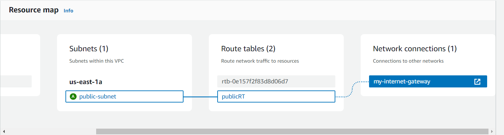

Now we have our vpc setup.
</details>

## Setting Up the EC2 Instance


<!-- ## Allocating and Associating an Elastic IP

`Elastic IPs` are static IP addresses designed for dynamic cloud computing. They allow your instance to maintain the `same IP address` even after it is stopped and started.

1. **Allocate an Elastic IP**:
    - Navigate to the Elastic IPs section in the EC2 dashboard.
    - Click "Allocate new address" and follow the prompts to create an Elastic IP.

2. **Associate the Elastic IP**:
    - Select the newly created Elastic IP.
    - Click "Actions" > "Associate Elastic IP address".
    - Choose your instance and private IP address to associate.

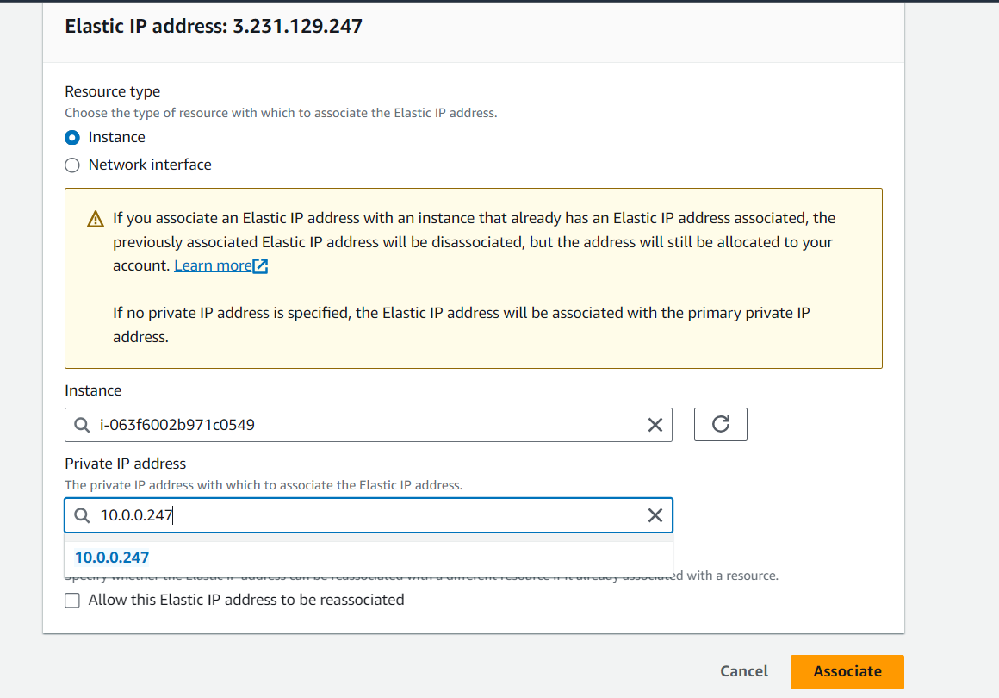 -->
## Setup K3s on AWS EC2

K3s is a lightweight Kubernetes distribution designed for resource-constrained environments.

To set up a Kubernetes cluster using k3s on AWS with one master node and two worker nodes, follow these steps:

### 1. Launch EC2 Instances:

- Launch three EC2 instances:
  - One for the master node.
  - Two for the worker nodes.
- Ensure that each instance has:
  - an Ubuntu AMI.
  - a free tier-eligible instance type (e.g., t2.micro or t3.micro)
  - Sufficient resources based on your workload requirements.
  - `Security groups` configured to allow necessary inbound and outbound traffic (including ports for k3s communication).
  - `Public IP` addresses for the master and worker nodes if you need to access them from outside the VPC.

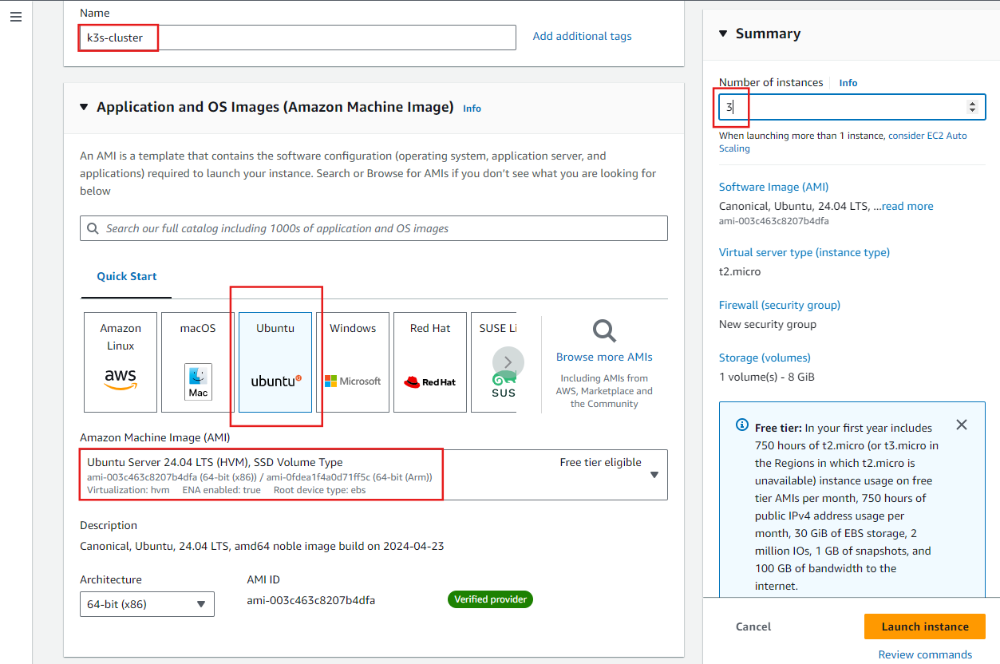

### 2. Accessing the EC2 Instance via SSH

To set up K3s on your EC2 instance, you need to access it via SSH. There are two main ways to do this:

### Using SSH Key

1. **SSH Command**: Use the following command to connect to your instance:

    ```sh
    ssh -i path_to_your_key.pem ubuntu@your_instance_ip
    ```

### Using AWS EC2 Instance Connect

**EC2 Instance Connect**:
- Select your instance in the AWS console.
- Click "Connect" and choose "EC2 Instance Connect".
- Open the terminal in your browser to access the instance.

For simplification we will use the AWS EC2 Instance Connect. 

### 3. Install k3s on Master Node:

- Run the following command on the master node to install k3s:
  ```bash
  curl -sfL https://get.k3s.io | sh -
  ```
- After installation, the master node should become the control plane for your Kubernetes cluster.

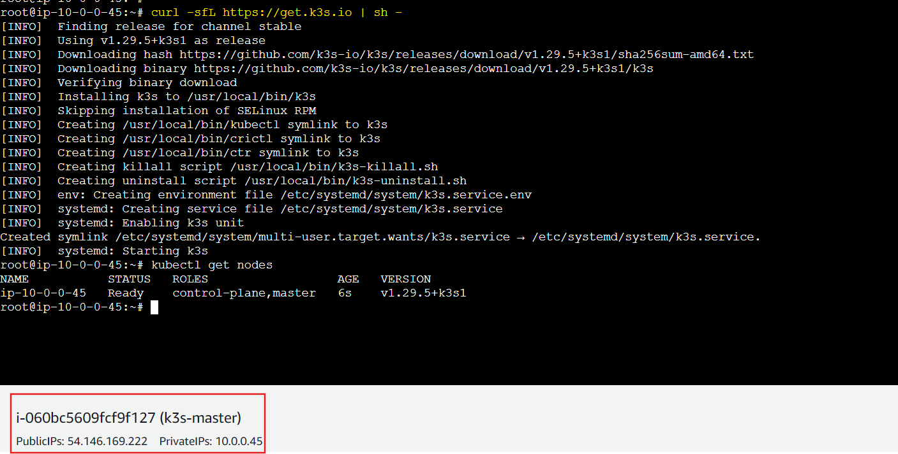

### 4. Test connectivity using PING or telnet

- Test the connectivity between the master node and the worker nodes using PING or telnet commands.

- Ensure that the security groups allow the necessary traffic between the nodes.

```sh
ping <worker-1_node_ip>
ping <worker-2_node_ip>
```
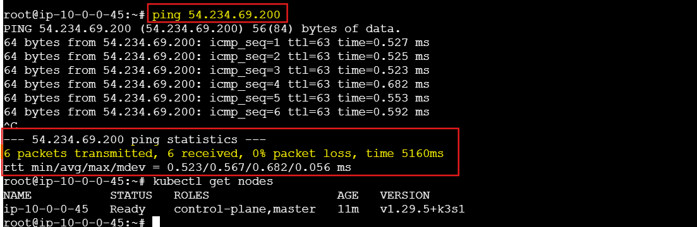

### 5. Join Worker Nodes to the Cluster:

- Retrieve the token from the master node to join worker nodes:
  ```bash
  sudo cat /var/lib/rancher/k3s/server/node-token
  ```
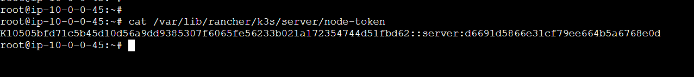

- Copy the token.

- SSH into each worker node and run the following command to join it to the cluster (replace `<master-ip>` with the private IP of the master node and `<token>` with the token obtained earlier):
  ```bash
  curl -sfL https://get.k3s.io | K3S_URL=https://<master-ip>:6443 K3S_TOKEN=<token> sh -
  ```
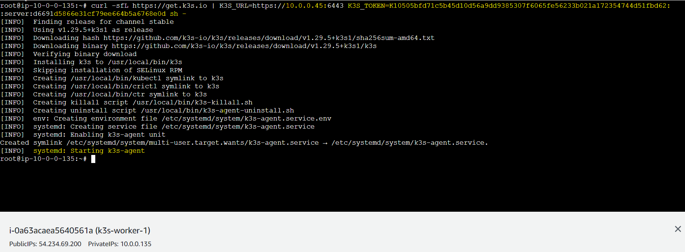

### 6. Verify Cluster Setup:

- SSH into the master node and verify that all nodes are part of the cluster:
  ```bash
  kubectl get nodes
  ```
- You should see the master node and both worker nodes listed as ready.

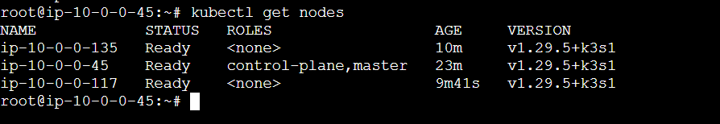

So, we have configured master node and two worker node. Lets deploy some application in the kubenetes.

## Exaple task: Deploy a nginx web server on k3s kubenetes destribution.

## Creating a K3s Kubernetes Cluster

To run an application on K3s, you need to create Kubernetes deployment and service files.

### Create Kubernetes Deployment File

1. **Create `k3s-app.yml`**:

    ```sh
    vi k3s-app.yml
    ```

2. Add the following content:

```yaml
apiVersion: apps/v1
kind: Deployment
metadata:
  name: k3s-app
  labels:
    app: k3s-app
spec:
  replicas: 1
  selector:
    matchLabels:
      app: k3s-app
  template:
    metadata:
      labels:
        app: k3s-app
    spec:
      containers:
        - name: k3s-app
          image: nginx:latest
          imagePullPolicy: Always
          ports:
            - containerPort: 80
---
apiVersion: v1
kind: Service
metadata:
  labels:
    app: k3s-app-service
  name: k3s-app-service
spec:
  ports:
    - name: "3000-80"
      port: 3000
      protocol: TCP
      targetPort: 80
  selector:
    app: k3s-app
  sessionAffinity: None
  type: ClusterIP
status:
  loadBalancer: {}
---
apiVersion: networking.k8s.io/v1
kind: Ingress
metadata:
  name: k3s-app-ingress
  annotations:
    ingress.kubernetes.io/ssl-redirect: "false"
spec:
  rules:
    - http:
        paths:
          - path: /
            pathType: Prefix
            backend:
              service:
                name: k3s-app-service
                port:
                  number: 3000
```

### Explanation

1. **Deployment**:
   - The `Deployment` named `k3s-app` is updated to use the `nginx:latest` image.
   - It will create a single replica (`replicas: 1`) of the Nginx container.

2. **Service**:
   - The `Service` named `k3s-app-service` is set to expose port 3000 and maps it to port 80 of the Nginx container.
   - It uses a `ClusterIP` type service to expose the application internally within the cluster.

3. **Ingress**:
   - The `Ingress` named `k3s-app-ingress` is configured to route HTTP traffic to the `k3s-app-service` on port 3000.
   - The annotation `ingress.kubernetes.io/ssl-redirect: "false"` indicates that SSL redirection is disabled.

### Applying the Manifest

Save this configuration to a file named `k3s-app.yml.yaml` and apply it using the following command:

```sh
kubectl apply -f k3s-app.yml.yaml
```

### Verify the Deployment

To check if the deployment, service, and ingress are created successfully, you can use the following commands:

```sh
kubectl get deployments
kubectl get services
kubectl get ingress
```

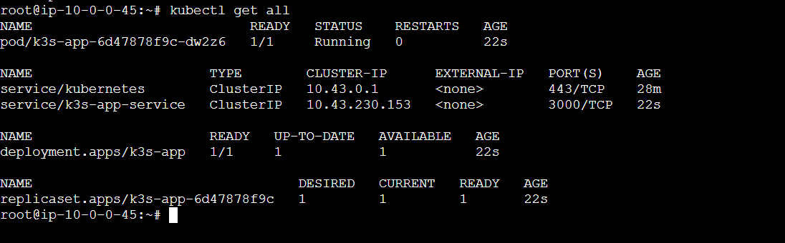


## Deploying Your Application

To test the deployment, get the <node-ip>:

```sh
kubectl get nodes -o wide
```
We can curl from the terminal using the node-ip:

```sh
curl <node-ip>
```
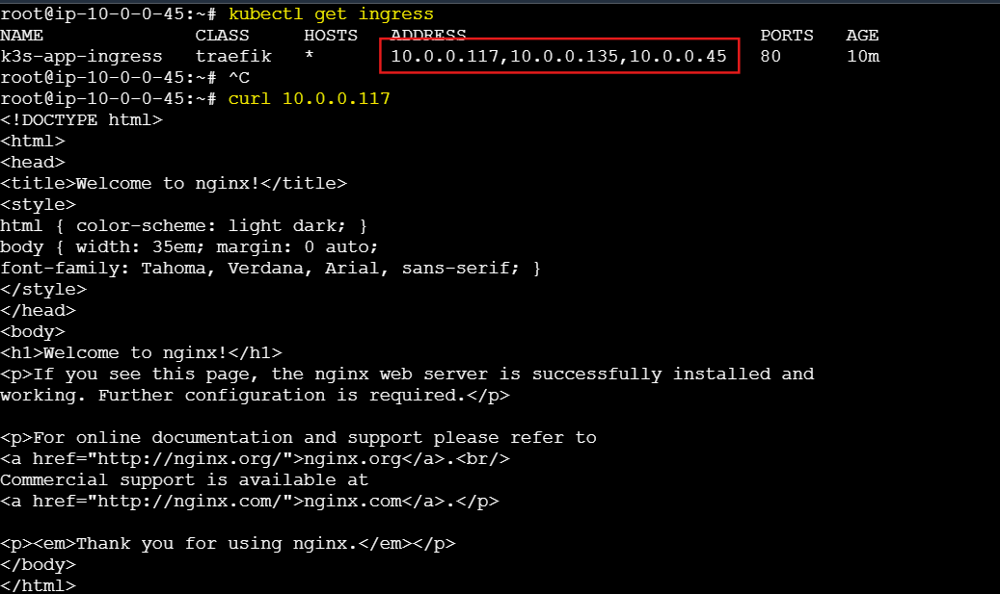

We can also check it from our browser. For example:

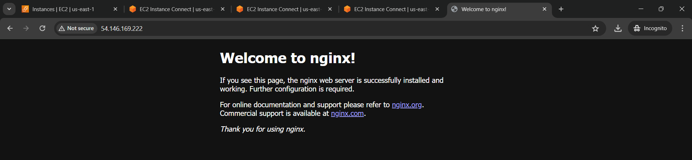

---

By following this documentation, we have successfully deployed a K3s Kubernetes cluster on AWS EC2 and run our application on it. This guide covers the setup of the EC2 instance, installation of K3s, Dockerizing and deploying an application, and configuring Kubernetes for production use.