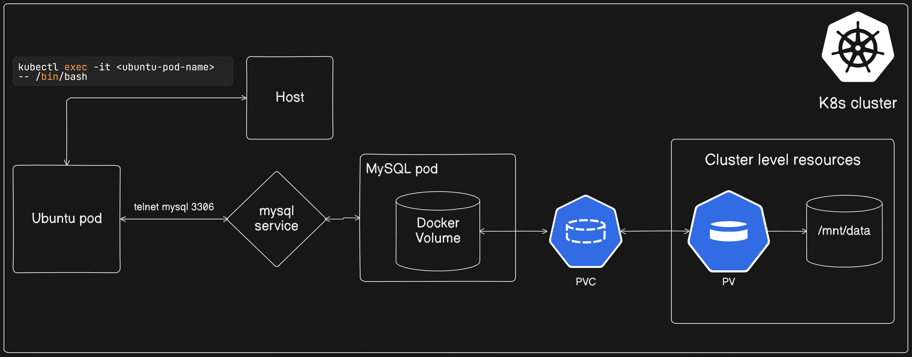
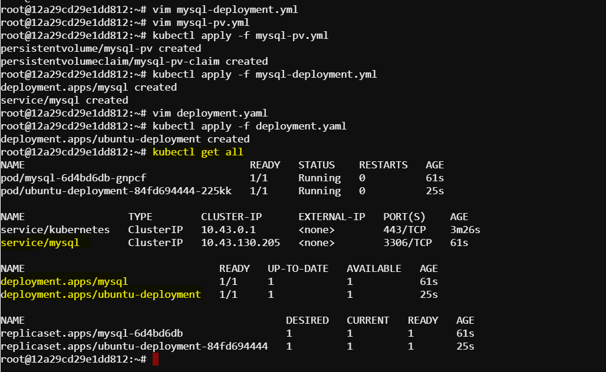
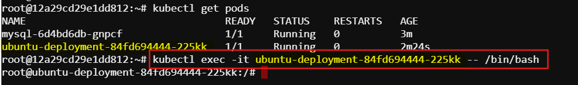
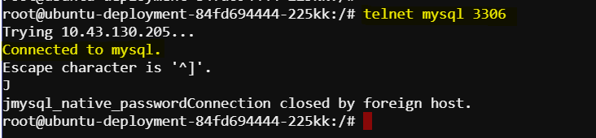
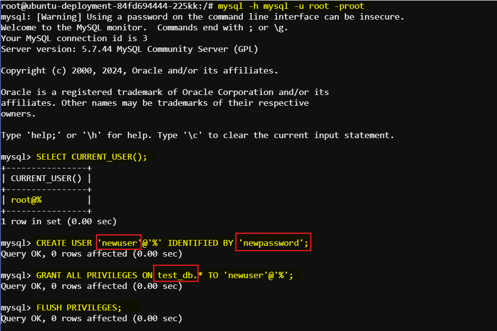
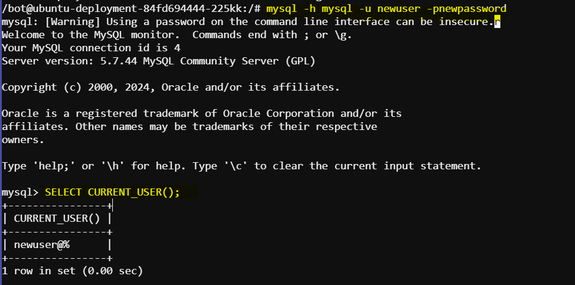

# Deploy MySQL into Kubernetes and access it from a Ubuntu container

In this documentation we will
- Deploy MySQL server in kubernetes using Persistent Volume.
- Deploy an Ubuntu container
- Access MySQl server from the ubuntu container.
    - First Test the MySQL server using telnet
    - Then test the MySQL server using MySQL client
- Create a new user



## Step 1: Create Kubernetes YAML files for deployment and service configuration for MySQL.

1. **Create a directory for Kubernetes manifests(Optional)**
   ```bash
   mkdir k8s
   cd k8s
   ```

2. **Create MySQL Deployment and Service**

   Create a file named `mysql-deployment.yml`:
   ```yaml
   apiVersion: apps/v1
   kind: Deployment
   metadata:
     name: mysql
   spec:
     selector:
       matchLabels:
         app: mysql
     strategy:
       type: Recreate
     template:
       metadata:
         labels:
           app: mysql
       spec:
         containers:
         - image: mysql:5.7
           name: mysql
           env:
           - name: MYSQL_ROOT_PASSWORD
             value: root
           - name: MYSQL_DATABASE
             value: test_db
           ports:
           - containerPort: 3306
             name: mysql
           volumeMounts:
           - name: mysql-persistent-storage
             mountPath: /var/lib/mysql
         volumes:
         - name: mysql-persistent-storage
           persistentVolumeClaim:
             claimName: mysql-pv-claim
   ---
   apiVersion: v1
   kind: Service
   metadata:
     name: mysql
   spec:
     ports:
     - port: 3306
     selector:
       app: mysql
   ```

   Create a file named `mysql-pv.yml`:
   ```yaml
   apiVersion: v1
   kind: PersistentVolume
   metadata:
     name: mysql-pv
   spec:
     capacity:
       storage: 1Gi
     accessModes:
       - ReadWriteOnce
     hostPath:
       path: "/mnt/data"
   ---
   apiVersion: v1
   kind: PersistentVolumeClaim
   metadata:
     name: mysql-pv-claim
   spec:
     resources:
       requests:
         storage: 1Gi
     accessModes:
       - ReadWriteOnce
   ```

3. Apply the Kubernetes manifests to create the deployments and services.

    ```bash
    kubectl apply -f mysql-pv.yml
    kubectl apply -f mysql-deployment.yml
    ```

## Step 02: Deploy an ubuntu container

1. Create a YAML file named `deployment.yaml` file using the official Ubuntu image:

    ```yaml
    apiVersion: apps/v1
    kind: Deployment
    metadata:
      name: ubuntu-deployment
    spec:
      replicas: 1
      selector:
        matchLabels:
          app: ubuntu
      template:
        metadata:
          labels:
            app: ubuntu
        spec:
          containers:
          - name: ubuntu-container
            image: ubuntu:latest
            command: ["/bin/bash", "-c", "--"]
            args: ["while true; do echo hello; sleep 10;done;"]
    ```

2. **Apply the YAML File**: Use `kubectl` to apply the deployment.

    ```sh
    kubectl apply -f deployment.yaml
    ```

### Step 3: Verify the Deployment

1. **Check Pods**: Verify that the pod is running.

    ```sh
    kubectl get pods
    ```

2. **Describe the Pod**: Get detailed information about the pod.

    ```sh
    kubectl describe pod <pod-name>
    ```

### Explanation

- **apiVersion**: Specifies the API version.
- **kind**: Specifies the type of Kubernetes object (Deployment).
- **metadata**: Contains metadata for the deployment, like its name.
- **spec**: Defines the specification of the deployment.
  - **replicas**: Number of pod replicas to run.
  - **selector**: Selector to match the pods managed by the deployment.
  - **template**: Defines the pod template.
    - **metadata**: Contains metadata for the pod.
    - **spec**: Defines the specification of the pod.
      - **containers**: Lists the containers in the pod.
        - **name**: Name of the container.
        - **image**: Docker image to use (official Ubuntu image in this case).
        - **command** and **args**: Specify the command to run inside the container. This example runs a simple bash loop to keep the container running.



## Step 03: Access MySQl from the ubuntu container

1. Check all the services and pods are running

  ```bash
  kubectl get pods
  kubectl get svc
  ```
2. Now get the ubuntu pod name and access the Ubuntu Container:

  ```sh
  kubectl exec -it <ubuntu-pod-name> -- /bin/bash
  ```
  

3. To telnet to the MySQL server from Ubuntu, you can use the `telnet` command along with the MySQL server's hostname or IP address and port number. However, connecting to MySQL using telnet is not `secure` and `not recommended` for production environments because it transmits data `in plain text`. Instead, it's better to use the `MySQL client` over a secure connection. If you still want to use telnet for **testing or debugging** purposes, here's how you can do it:

- **Install Telnet Client** (if not already installed):

   If the telnet client is not installed on your Ubuntu system, you can install it using the following command:

   ```sh
   apt-get update
   apt-get install telnet
   ```

- **Telnet to MySQL Server**:

  Once the telnet client is installed, you can use it to connect to the MySQL server.

  ```sh
  telnet <mysql-server-host> <mysql-server-port>
  ```
  Replace `<mysql-server-host>` with the hostname or IP address of your MySQL server and `<mysql-server-port>` with the port number (usually 3306 for MySQL).

  In our case:

  ```sh
  telnet mysql 3306
  ```

  

   This command will attempt to establish a telnet connection to the MySQL server. If successful, you'll see a blank screen, indicating that the connection is established.

- **Quit Telnet Session**:

   To quit the telnet session, you can press `Ctrl+]` to enter telnet command mode, then type `quit` and press Enter.
  
3. Install MySQL Client:

  Once inside the Ubuntu container, install the MySQL client:

  ```sh
  apt-get update
  apt-get install -y mysql-client
  ```
4. Connect to MySQL:

  Use the MySQL client to connect to the MySQL service as a root user:

  ```sh
  mysql -h mysql -u root -p<password>
  ```
  Replace <password> with your MySQL root password.

  

5. Create a new user in MySQL:

  Create a new user in MySQL using the following command:

  ```sql
  CREATE USER 'newuser'@'%' IDENTIFIED BY 'newpassword';
  GRANT ALL PRIVILEGES ON test_db.* TO 'newuser'@'%';
  FLUSH PRIVILEGES;
  ```
  Replace `newuser` and `newpassword` with the desired username and password.

6. Exit from the MySQL client and again access into the MySQL using the newly created user and password

  ```sh
  exit
  mysql -h mysql -u newuser -pnewpassword
  ```
  Here, we used the newly create user and password to acces into the MySQL database

7. We can also check the current user:

  ```sql
  SELECT CURRENT_USER();
  ```

  

That's it. We have deployed MySQL and ubunut container in kubernetes and accessed MySQL from the ubuntu container.