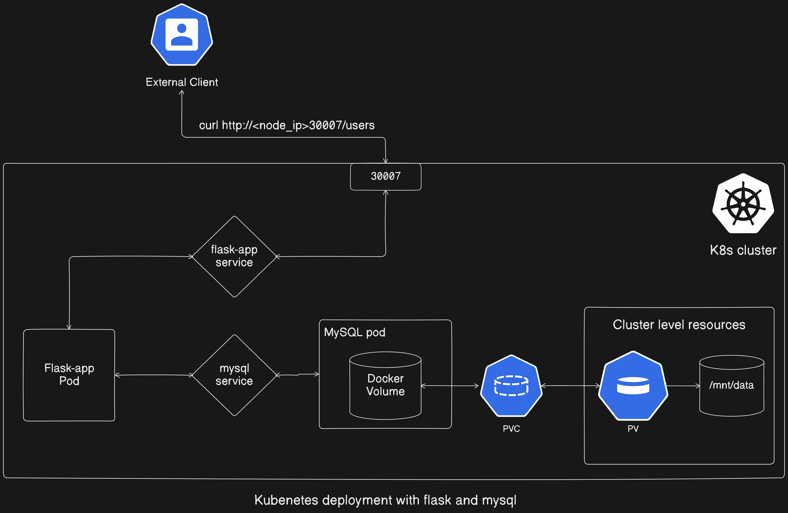

# Flask App and MySQL Deployment in Kubernetes

This documentation contains comprehensive instructions and configuration files for deploying a Flask application alongside a MySQL database within a Kubernetes (K8s) environment. 

## Overview

The provided setup includes:

- **Flask Application**: A simple Flask application (`app.py`) that interacts with a MySQL database to perform CRUD operations on user data. The Flask app exposes endpoints for adding, retrieving, updating, and deleting users.

- **Dockerfile**: A Dockerfile (`Dockerfile`) for building a Docker image of the Flask application.

- **Kubernetes Manifests**: Manifest files (`mysql_pv.yml`, `mysql_deploy_svc.yml`, `flask_deploy_svc.yml`) for deploying MySQL database pods and services, as well as Flask application pods and services in a Kubernetes cluster.

## Deployment Steps

1. **Create Flask App**: Edit the `app.py` file to define the Flask application and its endpoints for interacting with the MySQL database.

2. **Build Docker Image**: Use the provided Dockerfile to build a Docker image of the Flask application, including all necessary dependencies.

3. **Push to Docker Hub**: Push the built Docker image to Docker Hub or any other container registry for access during Kubernetes deployment.

4. **Create Kubernetes Resources**: Apply the provided Kubernetes manifest files to create `Persistent Volumes`, `Persistent Volume Claims`, `MySQL` deployments and services, and `Flask application` deployments and services within the Kubernetes cluster.

5. **Verification**: Verify the successful creation of deployments, pods, and services within the Kubernetes cluster using the `kubectl get all` command.

6. **Testing**: Test the Flask application endpoints by accessing them via the exposed NodePort, and perform CRUD operations on user data using `curl` commands.



## Step 1: Create Flask app

To create the Flask app, edit the `app.py` file as follows:

```python
from flask import Flask, request, jsonify
import mysql.connector
import os

app = Flask(__name__)

# Function to establish a database connection
def get_db_connection():
    return mysql.connector.connect(
        host=os.getenv('DB_HOST'),
        port=3306,
        user=os.getenv('DB_USER'),
        password=os.getenv('DB_PASSWORD'),
        database=os.getenv('DB_NAME'),
    )

# Function to create the users table if it doesn't exist
def create_users_table():
    connection = None
    try:
        connection = get_db_connection()
        if connection:
            cursor = connection.cursor()
            cursor.execute("""
                CREATE TABLE IF NOT EXISTS users (
                    id INT AUTO_INCREMENT PRIMARY KEY,
                    name VARCHAR(255) NOT NULL,
                    email VARCHAR(255) NOT NULL
                )
            """)
            connection.commit()
            print("Users table created successfully")
        else:
            print("Failed to connect to the database")
    except Error as err:
        print(f"Error creating users table: {err}")
    finally:
        if connection:
            connection.close()

# Automatically create the users table when the application starts
create_users_table()

# Endpoint to check MySQL database connection
@app.route('/')
def index():
    connection = get_db_connection()
    if connection.is_connected():
        return jsonify(message="Connected to MySQL database")
    else:
        return jsonify(message="Failed to connect to MySQL database"), 500

# Endpoint to get all users
@app.route('/users', methods=['GET'])
def get_users():
    conn = get_db_connection()
    cursor = conn.cursor(dictionary=True)
    cursor.execute("SELECT * FROM users")
    users = cursor.fetchall()
    cursor.close()
    conn.close()
    return jsonify(users)

# Endpoint to get a user by ID
@app.route('/users/<int:user_id>', methods=['GET'])
def get_user(user_id):
    conn = get_db_connection()
    cursor = conn.cursor(dictionary=True)
    cursor.execute("SELECT * FROM users WHERE id = %s", (user_id,))
    user = cursor.fetchone()
    cursor.close()
    conn.close()
    if user:
        return jsonify(user)
    else:
        return jsonify({'message': 'User not found'}), 404

# Endpoint to add a new user
@app.route('/users', methods=['POST'])
def add_user():
    new_user = request.json
    conn = get_db_connection()
    cursor = conn.cursor()
    cursor.execute("INSERT INTO users (name, email) VALUES (%s, %s)", (new_user['name'], new_user['email']))
    conn.commit()
    cursor.close()
    conn.close()
    return jsonify({'message': 'User added successfully!'}), 201

# Endpoint to update a user
@app.route('/users/<int:user_id>', methods=['PUT'])
def update_user(user_id):
    update_data = request.json
    conn = get_db_connection()
    cursor = conn.cursor()
    cursor.execute("UPDATE users SET name = %s, email = %s WHERE id = %s", (update_data['name'], update_data['email'], user_id))
    conn.commit()
    cursor.close()
    conn.close()
    if cursor.rowcount == 0:
        return jsonify({'message': 'User not found'}), 404
    else:
        return jsonify({'message': 'User updated successfully!'})

# Endpoint to delete a user
@app.route('/users/<int:user_id>', methods=['DELETE'])
def delete_user(user_id):
    conn = get_db_connection()
    cursor = conn.cursor()
    cursor.execute("DELETE FROM users WHERE id = %s", (user_id,))
    conn.commit()
    cursor.close()
    conn.close()
    if cursor.rowcount == 0:
        return jsonify({'message': 'User not found'}), 404
    else:
        return jsonify({'message': 'User deleted successfully!'})

if __name__ == '__main__':
    app.run(host='0.0.0.0')
```

## Step 2: Create a Dockerfile for Flask app

Here is the Dockerfile:

```docker
FROM python:3.8-slim-buster

WORKDIR /app

COPY . /app

RUN pip install --no-cache-dir Flask mysql-connector-python

EXPOSE 5000

ENV FLASK_APP=app.py

CMD ["flask", "run", "--host=0.0.0.0"]
```

## Step 3: Build image, add tag, push to Docker Hub

Use the following commands:

```bash
docker build -t flask-app-web .
docker tag flask-app-web:latest <username>/<repo-name>:latest
docker push <username>/<repo-name>:latest
```

In this case:

```bash
docker build -t flask-app-web .
docker tag flask-app-web:latest minhaz71/flask-app-web:latest
docker push minhaz71/flask-app-web:latest
```

The commands above build the Docker image for the Flask application, tag it, and push it to Docker Hub.

## Step 4: Create PersistentVolume and PersistentVolumeClaim for MySQL

Create `mysql_pv.yml` and edit the file:

```yaml
apiVersion: v1
kind: PersistentVolume
metadata:
  name: mysql-pv
spec:
  capacity:
    storage: 1Gi
  accessModes:
    - ReadWriteOnce
  hostPath:
    path: "/mnt/data"
---
apiVersion: v1
kind: PersistentVolumeClaim
metadata:
  name: mysql-pv-claim
spec:
  resources:
    requests:
      storage: 1Gi
  accessModes:
    - ReadWriteOnce
```

## Create Manifest for MySQL deployment and service

Create `mysql_deploy_svc.yml` and edit the file:

```yaml
apiVersion: apps/v1
kind: Deployment
metadata:
  name: mysql
spec:
  selector:
    matchLabels:
      app: mysql
  strategy:
    type: Recreate
  template:
    metadata:
      labels:
        app: mysql
    spec:
      containers:
      - image: mysql:5.7
        name: mysql
        env:
        - name: MYSQL_ROOT_PASSWORD
          value: root
        - name: MYSQL_DATABASE
          value: test_db
        ports:
        - containerPort: 3306
          name: mysql
        volumeMounts:
        - name: mysql-persistent-storage
          mountPath: /var/lib/mysql
      volumes:
      - name: mysql-persistent-storage
        persistentVolumeClaim:
          claimName: mysql-pv-claim
---
apiVersion: v1
kind: Service
metadata:
  name: mysql
spec:
  ports:
  - port: 3306
  selector:
    app: mysql
```

## Create Manifest for Flask app deployment and service

Create `flask_deploy_svc.yml` and edit the file:

```yaml
apiVersion: apps/v1
kind: Deployment
metadata:
  name: flask-app
spec:
  selector:
    matchLabels:
      app: flask-app
  template:
    metadata:
      labels:
        app: flask-app
    spec:
      containers:
      - name: flask-app
        image: minhaz71/flask-app-web:latest
        ports:
        - containerPort: 5000
        env:
        - name: FLASK_ENV
          value: development
        - name: DB_HOST
          value: mysql
        - name: DB_USER
          value: root
        - name: DB_PASSWORD
          value: root
        - name: DB_NAME
          value: test_db
---
apiVersion: v1
kind: Service
metadata:
  name: flask-app
spec:
  type: NodePort
  ports:
  - port: 5000
    nodePort: 30007
  selector:
    app: flask-app
```

## Apply these manifests

Use the following commands:

```bash
kubectl create -f mysql_pv.yml
kubectl create -f mysql_deploy_svc.yml
kubectl create -f flask_deploy_svc.yml
```

These commands will create Persistent Volume, Persistent Volume Claim, MySQL Pods and Services, Flask app Pods and Services.

## Step 5: Verify the created Deployments, Pods, and Services

Use the following command:

```bash
kubectl get all
```

## Test the Flask App

Since the Flask service is exposed as a NodePort, you can access it via the NodeIP and the node port. Here, the node port is 30007.

### Get NodeIP

```bash
kubectl get nodes -o wide
```

### Access the application

```bash
curl http://<NodeIP>:30007
```

### Try to get all users list and user by Id using the following command:

```bash
curl http://<NodeIP>:30007/users
curl http://<NodeIP>:30007/users/1
```

### Expected Output:

```bash
root@535473b69d023252:~# curl http://10.62.5.169:30007
{"message":"Connected to MySQL database"}

root@535473b69d023252:~# curl http://10.62.5.169:30007/users
[]

root@535473b69d023252:~# curl http://10.62.5.169:30007/users/1
{"message":"User not found"}
```

There are no users initially. Let’s create users and get the users list again.

```bash
curl -X POST -H "Content-Type: application/json" -d '{"name": "John Doe", "email": "john@example.com"}' http://10.62.5.169:30007/users
curl http://10.62.5.169:30007/users
curl -X POST -H "Content-Type: application/json" -d '{"name": "Minhaz Jisun", "email": "minhaz@example.com"}' http://10.62.5.169:30007/users
curl http://10.62.5.169:30007/users
curl http://10.62.5.169:30007/users/1
curl -X DELETE http://10.62.5.169:30007/users/1
curl http://10.62.5.169:30007/users
```

### Expected output:

```bash
root@535473b69d023252:~# curl -X POST -H "Content-Type: application/json" -d '{"name": "John Doe", "email": "john@example.com"}' http://10.62.5.169:30007/users
{"message":"User added successfully!"}

root@535473b69d023252:~# curl http://10.62.5.169:30007/users
[{"email":"john@example.com","id":1,"name":"John Doe"}]

root@535473b69d023252:~# curl -X POST -H "Content-Type: application/json" -d '{"name": "Minhaz Jisun", "email": "minhaz@example.com"}' http://10.62.5.169:30007/users
{"message":"User added successfully!"}

root@535473b69d023252:~# curl http://10.62.5.169:30007/users
[{"email":"john@example.com","id":1,"name":"John Doe"},{"email":"minhaz@example.com","id":2,"name":"Minhaz Jisun"}]

root@535473b69d023252:~# curl http://10.62.5.169:30007/users/1
{"email":"john@example.com","id":1,"name":"John Doe"}

root@535473b69d023252:~# curl -X DELETE http://10.62.5.169:30007/users/1
{"message":"User deleted successfully!"}

root@535473b69d023252:~# curl http://10.62.5.169:30007/users
[{"email":"minhaz@example.com","id":2,"name":"Minhaz Jisun"}]
```

These commands test the endpoints of the Flask application, demonstrating adding, retrieving, and deleting users.
     