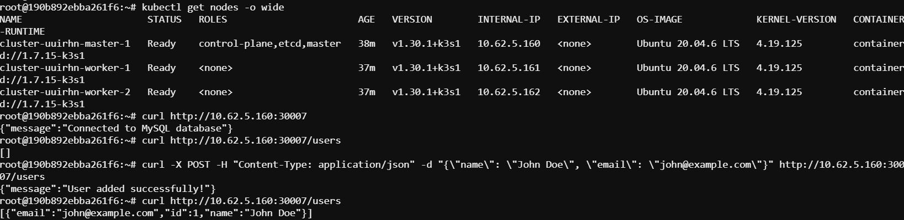

# Connect Flask and MySQL

## Step 1: Create Kubernetes YAML files for deployment and service configuration for MySQL.

1. **Create a directory for Kubernetes manifests(Optional)**
   ```bash
   mkdir k8s
   cd k8s
   ```

2. **Create MySQL Deployment and Service**

   Create a file named `mysql-deployment.yml`:
   ```yaml
   apiVersion: apps/v1
   kind: Deployment
   metadata:
     name: mysql
   spec:
     selector:
       matchLabels:
         app: mysql
     strategy:
       type: Recreate
     template:
       metadata:
         labels:
           app: mysql
       spec:
         containers:
         - image: mysql:5.7
           name: mysql
           env:
           - name: MYSQL_ROOT_PASSWORD
             value: root
           - name: MYSQL_DATABASE
             value: test_db
           ports:
           - containerPort: 3306
             name: mysql
           volumeMounts:
           - name: mysql-persistent-storage
             mountPath: /var/lib/mysql
         volumes:
         - name: mysql-persistent-storage
           persistentVolumeClaim:
             claimName: mysql-pv-claim
   ---
   apiVersion: v1
   kind: Service
   metadata:
     name: mysql
   spec:
     ports:
     - port: 3306
     selector:
       app: mysql
   ```

   Create a file named `mysql-pv.yml`:
   ```yaml
   apiVersion: v1
   kind: PersistentVolume
   metadata:
     name: mysql-pv
   spec:
     capacity:
       storage: 1Gi
     accessModes:
       - ReadWriteOnce
     hostPath:
       path: "/mnt/data"
   ---
   apiVersion: v1
   kind: PersistentVolumeClaim
   metadata:
     name: mysql-pv-claim
   spec:
     resources:
       requests:
         storage: 1Gi
     accessModes:
       - ReadWriteOnce
   ```

3. Apply the Kubernetes manifests to create the deployments and services.

    ```bash
    kubectl apply -f mysql-pv.yml
    kubectl apply -f mysql-deployment.yml
    ```

## Step 02: Exec into the MySQL container and create `users` table

1. First exec into MySQL container

    ```bash
    kubectl exec -it <MySQL_pod_name> -- /bin/bash
    ```
2. Login to MySQL database using the credentials

    ```bash
    mysql -h mysql -u root -proot
    ```
    

3. Create a table named `users` in the required database.

    ```sql
    CREATE TABLE users (
        id INT AUTO_INCREMENT PRIMARY KEY,
        name VARCHAR(255),
        email VARCHAR(255) UNIQUE
    );
    ```

## Step 05: Create Flask Deployment and Service

1. Create a file named `flask-deployment.yml`:

    ```yaml
    apiVersion: apps/v1
    kind: Deployment
    metadata:
      name: flask-app
    spec:
      selector:
        matchLabels:
          app: flask-app
      template:
        metadata:
          labels:
            app: flask-app
        spec:
          containers:
          - name: flask-app
            image: fazlulkarim105925/flask-app:latest
            ports:
            - containerPort: 5000
            env:
            - name: DB_HOST
              value: mysql
            - name: DB_USER
              value: root
            - name: DB_PASSWORD
              value: root
            - name: DB_NAME
              value: test_db
    ---
    apiVersion: v1
    kind: Service
    metadata:
      name: flask-app
    spec:
      type: NodePort
      ports:
      - port: 5000
        nodePort: 30007
      selector:
        app: flask-app
    ```

2. Apply the Kubernetes manifests to create the deployments and services.

- **Apply Flask Deployment**
   ```bash
   kubectl apply -f flask-deployment.yml
   ```

3. Verify Deployment

Check the status of your deployments and services.

- **Get the list of pods**
   ```bash
   kubectl get pods
   ```

- **Get the list of services**
   ```bash
   kubectl get services
   ```

## Step 5: Access the Flask Application

Since the Flask service is exposed as a `NodePort`, we can access it via the `NodeIP` and the node port. Here, the node port is `30007`

1. **Get NodeIP**
   ```bash
   kubectl get nodes -o wide
   ```

2. **Access the application**
   ```bash
   curl http://<NodeIP>:30007
   ```
   

### Step 8: Testing the API

Use `curl` to test the API endpoints:

#### Example `curl` Commands:

- **Create a User**:
  ```bash
  curl -X POST -H "Content-Type: application/json" -d "{\"name\": \"John Doe\", \"email\": \"john@example.com\"}" http://<NodeIP>:30007/users
  ```

- **Get All Users**:
  ```bash
  curl http://<NodeIP>:30007/users
  ```

  

  

- **Get a Single User**:
  ```bash
  curl http://<NodeIP>:30007/users/1
  ```

- **Update a User**:
  ```bash
  curl -X PUT -H "Content-Type: application/json" -d "{\"name\": \"Jane Doe\", \"email\": \"jane@example.com\"}" http://<NodeIP>:30007/users/1
  ```

- **Delete a User**:
  ```bash
  curl -X DELETE http://<NodeIP>:30007/users/1
  ```

Thats it!. By following these steps, we have deployed our Flask application with MySQL to kubernetes. In the next lab we will automate the database creation.