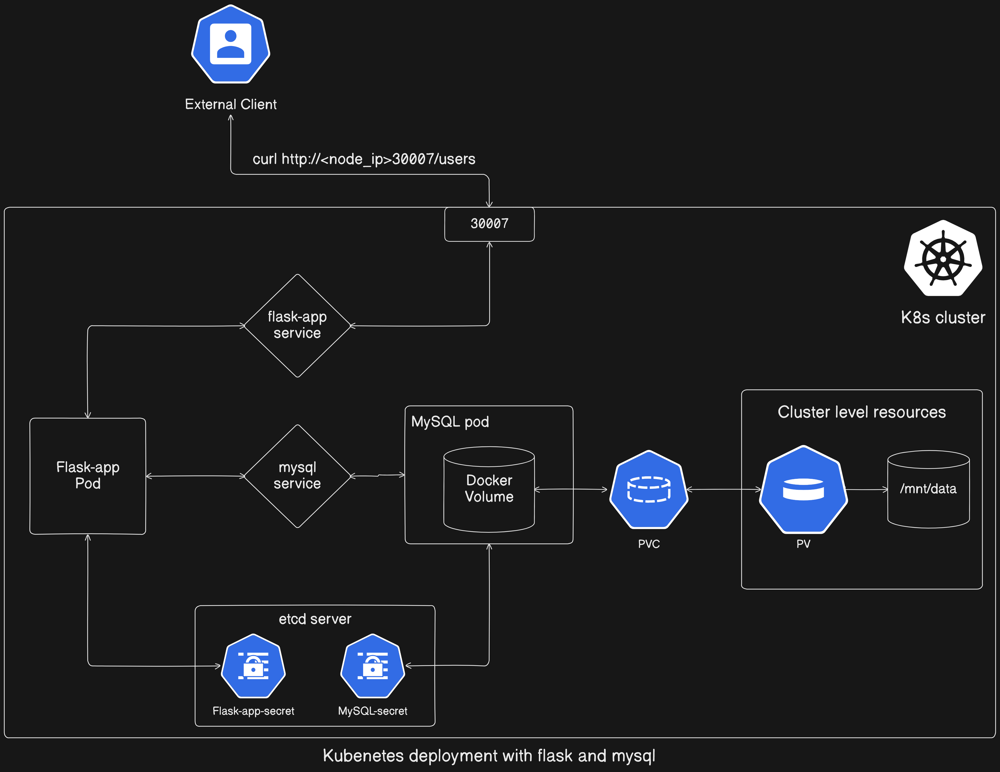
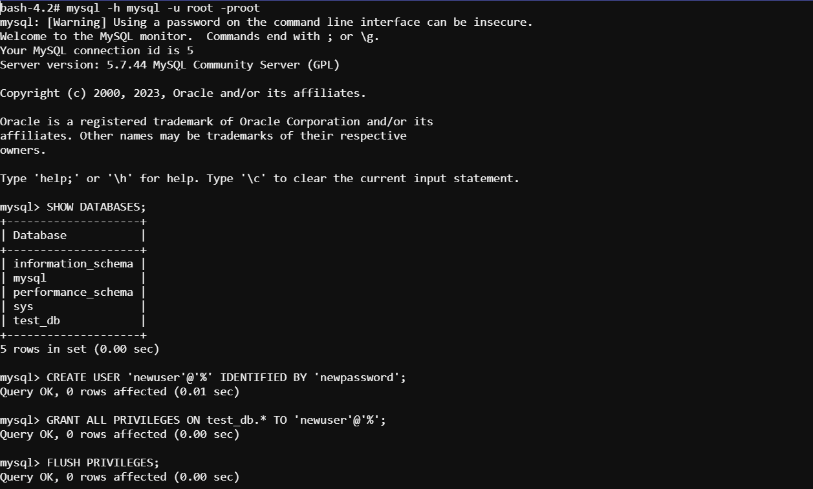
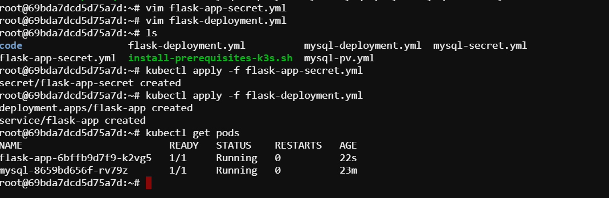
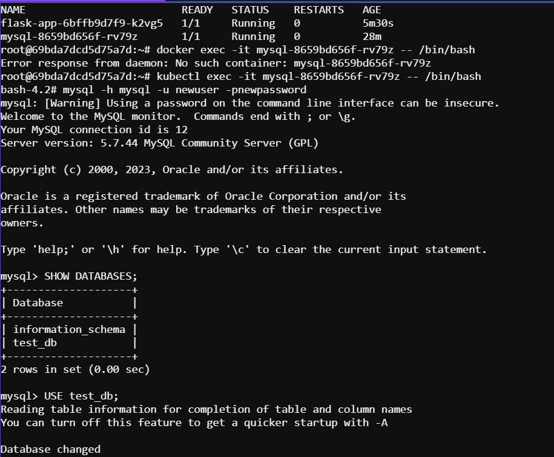
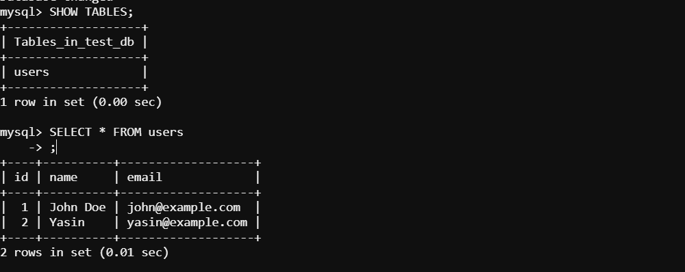

# Create Flask and MySQL deployments using secrets.

In this lab, we'll set up Flask and MySQL deployments in Kubernetes, utilizing secrets for secure credential storage. Here's what we'll cover:

- Building a Flask application capable of interacting with a MySQL database.
- Creating image for the Flask application and push it to docker hub.
- Employing secrets to securely store the database access credentials.
- Deploying a MySQL container within Kubernetes, utilizing secrets for credential management.
- Creating a new user, 'newuser', within the designated database, complete with required credentials.
- Deploying the Flask application in Kubernetes, with credentials mounted as a secret.
- Verifying database connectivity and testing API endpoints.



<details>
<summary>Flask application development. Click to expand!</summary>
<p>

## Building a Flask rest api application

To create Flask rest API application, we will create a file named `app.py` and write code for the application as follows:

### app.py

```python
from flask import Flask, jsonify, request
import mysql.connector
import os
from mysql.connector import Error

app = Flask(__name__)

def get_db_connection():
    try:
        # Read database connection details from environment variables
        db_host = os.getenv('DB_HOST', 'localhost')
        db_user = os.getenv('DB_USER', 'root')
        db_password = os.getenv('DB_PASSWORD', 'root')
        db_name = os.getenv('DB_NAME', 'test_db')

        # Connect to the MySQL database
        connection = mysql.connector.connect(
            host=db_host,
            user=db_user,
            password=db_password,
            database=db_name
        )

        if connection.is_connected():
            return connection
        else:
            raise Error("Failed to connect to the database")

    except Error as err:
        print(f"Error: {err}")
        return None
    
def create_users_table():
    connection = None
    try:
        connection = get_db_connection()
        if connection:
            cursor = connection.cursor()
            cursor.execute("""
                CREATE TABLE IF NOT EXISTS users (
                    id INT AUTO_INCREMENT PRIMARY KEY,
                    name VARCHAR(255) NOT NULL,
                    email VARCHAR(255) NOT NULL
                )
            """)
            connection.commit()
            print("Users table created successfully")
        else:
            print("Failed to connect to the database")

    except Error as err:
        print(f"Error creating users table: {err}")

    finally:
        if connection:
            connection.close()

# Automatically create the users table when the application starts
create_users_table()

# Get all users
@app.route('/users', methods=['GET'])
def get_users():
    connection = None
    cursor = None
    try:
        connection = get_db_connection()
        if connection:
            cursor = connection.cursor(dictionary=True)
            cursor.execute("SELECT * FROM users")
            users = cursor.fetchall()
            return jsonify(users)
        else:
            return "Failed to connect to the database", 500

    except Error as err:
        return str(err), 500

    finally:
        if cursor:
            cursor.close()
        if connection:
            connection.close()

# Get a specific user by ID
@app.route('/users/<int:user_id>', methods=['GET'])
def get_user(user_id):
    connection = None
    cursor = None
    try:
        connection = get_db_connection()
        if connection:
            cursor = connection.cursor(dictionary=True)
            cursor.execute("SELECT * FROM users WHERE id = %s", (user_id,))
            user = cursor.fetchone()
            if user:
                return jsonify(user)
            else:
                return "User not found", 404
        else:
            return "Failed to connect to the database", 500

    except Error as err:
        return str(err), 500

    finally:
        if cursor:
            cursor.close()
        if connection:
            connection.close()

# Create a new user
@app.route('/users', methods=['POST'])
def create_user():
    connection = None
    cursor = None
    try:
        data = request.json
        name = data.get('name')
        email = data.get('email')

        connection = get_db_connection()
        if connection:
            cursor = connection.cursor()
            cursor.execute("INSERT INTO users (name, email) VALUES (%s, %s)", (name, email))
            connection.commit()
            return "User created successfully", 201
        else:
            return "Failed to connect to the database", 500

    except Error as err:
        return str(err), 500

    finally:
        if cursor:
            cursor.close()
        if connection:
            connection.close()

# Update an existing user
@app.route('/users/<int:user_id>', methods=['PUT'])
def update_user(user_id):
    connection = None
    cursor = None
    try:
        data = request.json
        name = data.get('name')
        email = data.get('email')

        connection = get_db_connection()
        if connection:
            cursor = connection.cursor()
            cursor.execute("UPDATE users SET name = %s, email = %s WHERE id = %s", (name, email, user_id))
            connection.commit()
            if cursor.rowcount > 0:
                return "User updated successfully", 200
            else:
                return "User not found", 404
        else:
            return "Failed to connect to the database", 500

    except Error as err:
        return str(err), 500

    finally:
        if cursor:
            cursor.close()
        if connection:
            connection.close()

# Delete a user
@app.route('/users/<int:user_id>', methods=['DELETE'])
def delete_user(user_id):
    connection = None
    cursor = None
    try:
        connection = get_db_connection()
        if connection:
            cursor = connection.cursor()
            cursor.execute("DELETE FROM users WHERE id = %s", (user_id,))
            connection.commit()
            if cursor.rowcount > 0:
                return "User deleted successfully", 200
            else:
                return "User not found", 404
        else:
            return "Failed to connect to the database", 500

    except Error as err:
        return str(err), 500

    finally:
        if cursor:
            cursor.close()
        if connection:
            connection.close()

if __name__ == '__main__':
    app.run(host='0.0.0.0')
```

## Write Dockerfile, build and push the image

```Dockerfile
# Use an official Python runtime as a parent image
FROM python:3.8-slim

# Set the working directory in the container
WORKDIR /app

# Copy the requirements.txt file into the container at /app
COPY requirements.txt requirements.txt

# Install any needed packages specified in requirements.txt
RUN pip install --no-cache-dir -r requirements.txt

# Copy the rest of the working directory contents into the container at /app
COPY . .

# Make port 5000 available to the world outside this container
EXPOSE 5000

# Run app.py when the container launches
CMD ["python", "app.py"]
```

### Build the Image

```sh
docker build -t flaskrestapi-web .
```
### Push it to your docker hub repository

```bash
docker tag flaskrestapi-web:latest <username>/<repo-name>:<version>
docker push <username>/<repo-name>:<version>
```

</p>
</details>

## Step 01: Deploy MySQL container in kubernetes utilizing secrets

1. Create secrets

Create a manifest file named `mysql-secret.yml`. Make sure to encoded the secret values.

```yml
apiVersion: v1
kind: Secret
metadata:
  name: mysql-secret
type: Opaque
data:
  MYSQL_ROOT_PASSWORD: cm9vdA==  # base64 encoded value of 'root'
  MYSQL_DATABASE: dGVzdF9kYg==  # base64 encoded value of 'test_db'
```

2. Create Persistent Volume

Create a manifest file named `mysql-pv.yml` for persistent olume and persistent volumen claim.

```yml
apiVersion: v1
kind: PersistentVolume
metadata:
  name: mysql-pv
spec:
  capacity:
    storage: 1Gi
  accessModes:
    - ReadWriteOnce
  hostPath:
    path: "/mnt/data"
---
apiVersion: v1
kind: PersistentVolumeClaim
metadata:
  name: mysql-pv-claim
spec:
  resources:
    requests:
      storage: 1Gi
  accessModes:
    - ReadWriteOnce
```
3. Create Deployment

Create MySQL deployment manifest file named `mysql-deployment.yml`

```yml
apiVersion: apps/v1
kind: Deployment
metadata:
  name: mysql
spec:
  selector:
    matchLabels:
      app: mysql
  strategy:
    type: Recreate
  template:
    metadata:
      labels:
        app: mysql
    spec:
      containers:
      - image: mysql:5.7
        name: mysql
        envFrom:
        - secretRef:
            name: mysql-secret
        ports:
        - containerPort: 3306
          name: mysql
        volumeMounts:
        - name: mysql-persistent-storage
          mountPath: /var/lib/mysql
      volumes:
      - name: mysql-persistent-storage
        persistentVolumeClaim:
          claimName: mysql-pv-claim
---
apiVersion: v1
kind: Service
metadata:
  name: mysql
spec:
  ports:
  - port: 3306
  selector:
    app: mysql
```
### Apply these manifests file

Apply these manifests file to create the necessary deployements, secrets and services.

```sh
kubectl apply -f mysql-secret.yml
kubectl apply -f mysql_pv.yml
kubectl apply -f mysql_deploy_svc.yml
```

## Step 2: Creating a new user, `newuser`, within the designated database.

1. First exec into the MySQL container

```bash
kubectl exec -it <MySQL_pod_name_or_id> -- /bin/bash
```

2. Login as default(root) user

```bash
mysql -h <mysql_service_name> -u root -proot
```
In our case MySQL service name is `mysql`

3. Use the designated database(test_db) and create a new user

```sql
SHOW DATABASES;
USE <database_name>;
```
In our case database_name is `test-db`. Now create a new user with necessary credentials and permissions.

```sql
CREATE USER 'newuser'@'%' IDENTIFIED BY 'newpassword';
GRANT ALL PRIVILEGES ON test_db.* TO 'newuser'@'%';
FLUSH PRIVILEGES;
```
Here's what each part means:

- `'newuser'`: This is the username you are creating.
- `'@'`: This separates the username from the hostname or IP address.
- `'%'`: This indicates that the user can connect from any host. If you wanted to restrict connections to a specific host or IP address, you would replace `'%'` with the hostname or IP address.



## Step 3: Deploying the Flask application with necessary credentials mounted as a secret.

1. Create a manifest file for secret named `flask-app-secret.yml`

Here, we have used the credentials for newly created user named `newuser`.

```yml
apiVersion: v1
kind: Secret
metadata:
  name: flask-app-secret
type: Opaque
data:
  DB_HOST: bXlzcWw=  # base64 encoded value of 'mysql'
  DB_USER: bmV3dXNlcg==  # base64 encoded value of 'newuser'
  DB_PASSWORD: bmV3cGFzc3dvcmQ=  # base64 encoded value of 'newpassword'
  DB_NAME: dGVzdF9kYg==  # base64 encoded value of 'test_db'
```

2. Create manifest file for flask app deployment named `flask-deployment.yml`

```yml
apiVersion: apps/v1
kind: Deployment
metadata:
  name: flask-app
spec:
  selector:
    matchLabels:
      app: flask-app
  template:
    metadata:
      labels:
        app: flask-app
    spec:
      containers:
      - name: flask-app
        image: konami98/flaskrestapi-web:v5.2
        ports:
        - containerPort: 5000
        envFrom:
        - secretRef:
            name: flask-app-secret
---
apiVersion: v1
kind: Service
metadata:
  name: flask-app
spec:
  type: NodePort
  ports:
  - port: 5000
    nodePort: 30007
  selector:
    app: flask-app
```
3. Apply the manifests file:

```sh
kubectl apply -f flask-app-secret.yml
kubectl apply -f flask-deployment.yml
```



## Step 4: Verifying database connectivity and testing API endpoints.

1. Test the Flask App

Since the Flask service is exposed as a NodePort, we can access it via the `NodeIP` and the `node port`. Here, the node port is `30007`.

### Get NodeIP

```bash
kubectl get nodes -o wide
```

### Access the application and try to get all users list and user by Id using the following command:

```bash
curl http://<NodeIP>:30007/users
curl http://<NodeIP>:30007/users/1
```

### Expected Output:

```bash
root@535473b69d023252:~# curl http://10.62.5.169:30007
{"message":"Connected to MySQL database"}

root@535473b69d023252:~# curl http://10.62.5.169:30007/users
[]

root@535473b69d023252:~# curl http://10.62.5.169:30007/users/1
{"message":"User not found"}
```

There are no users initially. Let’s create users and get the users list again.

```bash
curl -X POST -H "Content-Type: application/json" -d '{"name": "John Doe", "email": "john@example.com"}' http://<node-ip>:30007/users
curl http://<node-ip>:30007/users
curl -X POST -H "Content-Type: application/json" -d '{"name": "Yasin", "email": "yasin@example.com"}' http://<node-ip>:30007/users
curl http://<node-ip>:30007/users
curl http://<node-ip>:30007/users/1
curl -X DELETE http://<node-ip>:30007/users/1
curl http://<node-ip>:30007/users
```
Here, rememeber to replace the <node-ip>.

### Expected output:

```bash
root@535473b69d023252:~# curl -X POST -H "Content-Type: application/json" -d '{"name": "John Doe", "email": "john@example.com"}' http://10.62.5.169:30007/users
{"message":"User added successfully!"}

root@535473b69d023252:~# curl http://10.62.5.169:30007/users
[{"email":"john@example.com","id":1,"name":"John Doe"}]

root@535473b69d023252:~# curl -X POST -H "Content-Type: application/json" -d '{"name": "Yasin", "email": "yasin@example.com"}' http://10.62.5.169:30007/users
{"message":"User added successfully!"}

root@535473b69d023252:~# curl http://10.62.5.169:30007/users
[{"email":"john@example.com","id":1,"name":"John Doe"},{"email":"yasin@example.com","id":2,"name":"Yasin"}]

root@535473b69d023252:~# curl http://10.62.5.169:30007/users/1
{"email":"john@example.com","id":1,"name":"John Doe"}

root@535473b69d023252:~# curl -X DELETE http://10.62.5.169:30007/users/1
{"message":"User deleted successfully!"}

root@535473b69d023252:~# curl http://10.62.5.169:30007/users
[{"email":"yasin@example.com","id":2,"name":"Yasin"}]
```

These commands test the endpoints of the Flask application, demonstrating adding, retrieving, and deleting users.

2. Test the database

### Exec into the MySQL container

```sh
kubectl exec -it <mysql-pod-name-or-id> -- /bin/bash
```
Replace `<mysql-pod-name-or-id>` with the actual name or ID of the MySQL pod.

### Access into the MySQL database

```sh
mysql -h mysql -u newuser -pnewpassword
```
Replace `newuser` and `newpassword` with the actual username and password you specified in the creation of new user.\



### Use the required database and show the database content

```sql
USE test_db;
SHOW TABLES;
SELECT * FROM users;
```

**Expected Output:**



Thats it for this lab. What we have done in this entire lab? Create a Flask application, containerized it, deployed it to Kubernetes, and connected it to a MySQL database. We also tested the application and database to ensure they are working as expected.
