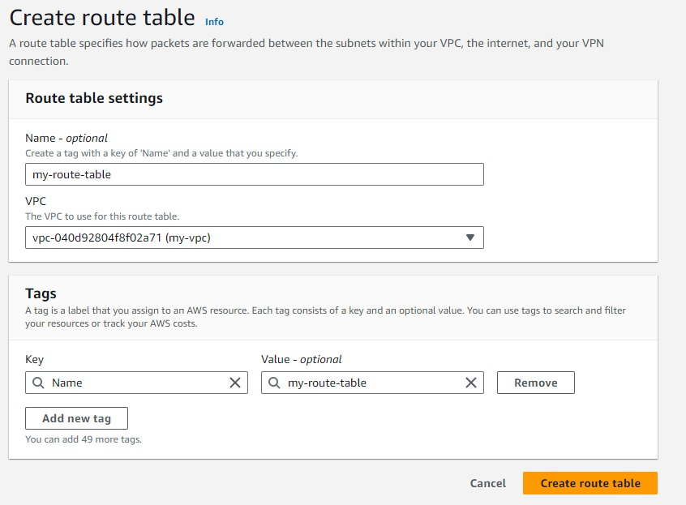
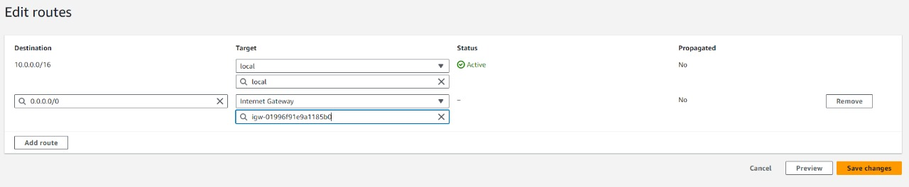
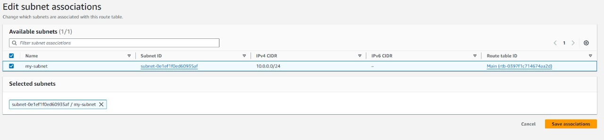
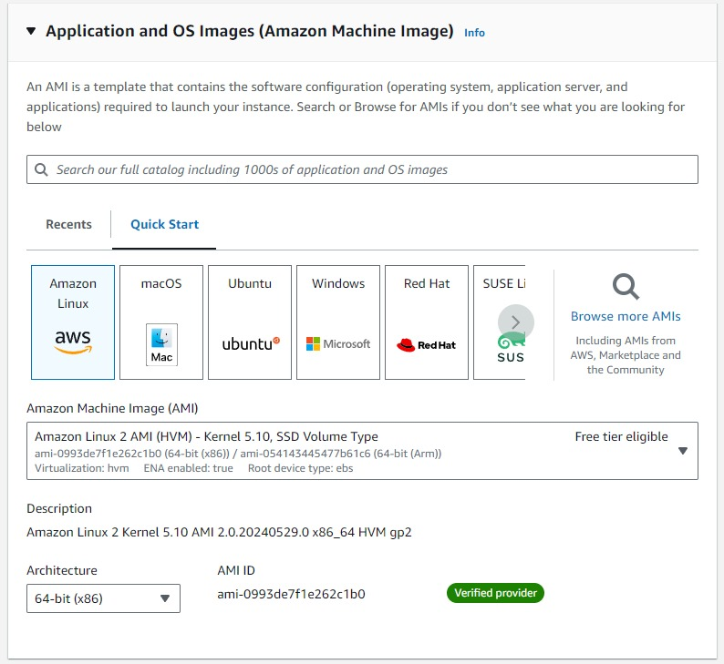
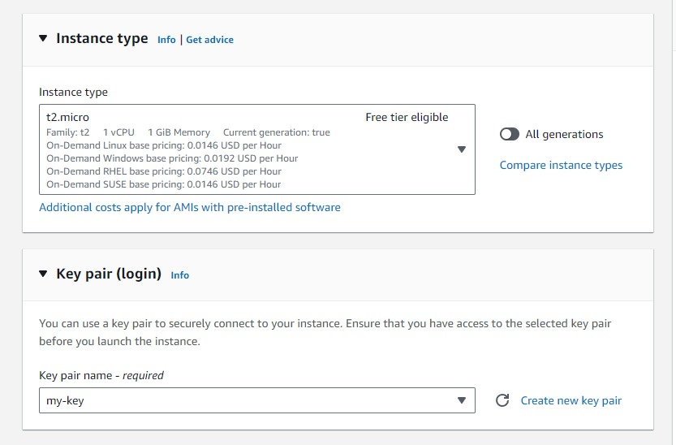
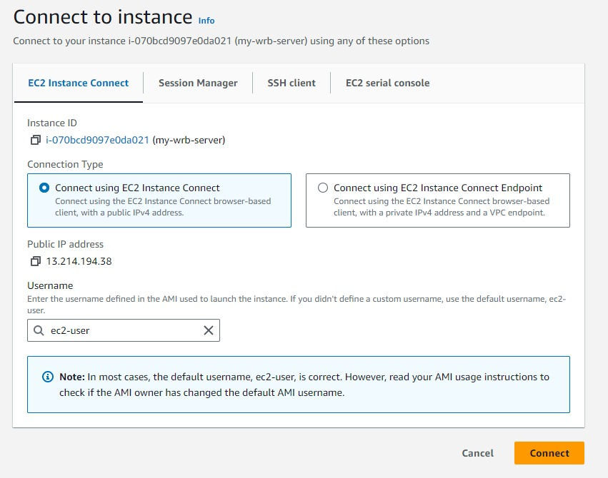
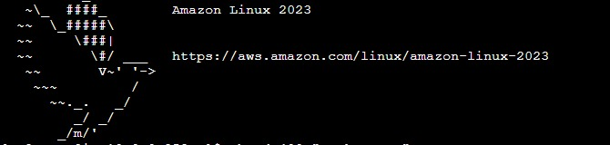
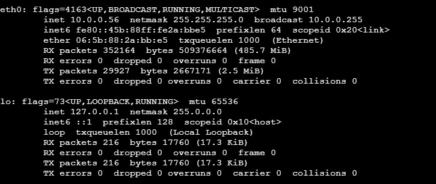
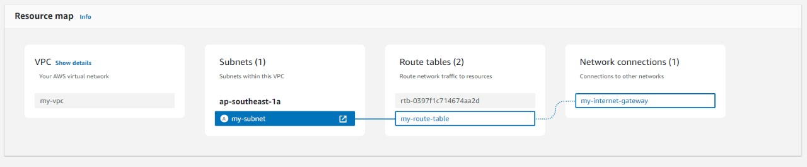

# AWS VPC and EC2 Setup Documentation

## Overview
This guide will teach you how to set up a Virtual Private Cloud (VPC) from scratch and launch an EC2 instance within it. By the end of this guide, you will have created a VPC, set up a public subnet, configured routing with an Internet Gateway, and launched an EC2 instance.

## Learning Objectives
1. Create a VPC with CIDR 10.0.0.0/16
2. Create a Public Subnet within the VPC
3. Create and Attach an Internet Gateway to the VPC
4. Configure Route Tables for Internet Access
5. Launch an EC2 Instance in the Subnet
6. Access the EC2 Instance

## Step-by-Step Guide

### Step 1: Create Your VPC
1. **Open the AWS Management Console** and search for "VPC" in the search bar.
2. On the left-hand side, click on "Your VPCs".
3. Click on "Create VPC" at the top right corner.

   

4. Name your VPC using a tag.
5. Set the IPv4 CIDR block to `10.0.0.0/16`.

   Congratulations on creating your first VPC!

### Step 2: Create a Public Subnet
1. After creating your VPC, click on "Subnets" on the left-hand side.
2. Click on "Create Subnet".

   <!--  -->
   

3. Designate the VPC you just created.
4. Assign a CIDR block within your VPC’s range (e.g., `10.0.1.0/24`).
5. Click on the created subnet and then "Edit subnet settings".
6. Enable "Auto-assign public IPv4 address" and save.

   <!--  -->
   

### Step 3: Create and Attach an Internet Gateway
1. Click on "Internet Gateways" on the left-hand side.
2. Click "Create internet gateway".

   <!--  -->
   

3. Once created, click "Actions" and then "Attach to VPC".
4. Select your VPC and attach the Internet Gateway.

   

### Step 4: Create Route Tables
1. Click on "Route Tables" on the left-hand side.
2. Click "Create route table".

   <!--  -->
   

3. Associate the new route table with your VPC.
4. Add a route to allow internet traffic by specifying the destination `0.0.0.0/0` and target as your Internet Gateway.

   <!--  -->
   

5. Click on the "Subnet Associations" tab, then "Edit Subnet Associations".
6. Select your public subnet and save.

   <!--  -->
   

### Step 5: Launch an EC2 Instance
1. In the AWS console, search for "EC2" and click on "Launch Instance".
2. Select the Amazon Machine Image (AMI) for Amazon Linux.

   

3. Choose the instance type, e.g., `t2.micro`.
4. Configure instance details, selecting the VPC and public subnet you created.
5. Create a key pair (.pem file) and save it securely.

   <!--  -->
   

6. Configure the security group to allow SSH (port 22) and HTTP (port 80) access.
7. Click "Launch".

### Step 6: Access the EC2 Instance
1. Select your running instance in the EC2 console.
2. Click "Connect".

   <!--  -->
   


3. Once connected, it will launch a amazon linux terminal.

   

   run the following command to verify network settings:

   ```bash
   ifconfig -a
   ```

   <!--  -->
   

### Network Diagram
Below is a visual representation of the VPC setup with subnets in different Availability Zones (AZs).

   <!--  -->
   

Congratulations on successfully completing this hands-on lab!
