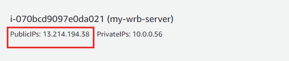

# Building a Flask REST API with SQLAlchemy and Docker on Amazon EC2

### Introduction
Flask is a lightweight and flexible web framework for Python, ideal for building RESTful APIs. SQLAlchemy is a powerful SQL toolkit and Object-Relational Mapping (ORM) library for Python, providing a high-level abstraction for database interactions.

In this guide, we'll demonstrate how to integrate SQLAlchemy with Flask to create a REST API connected to a MySQL database. Additionally, we'll utilize Docker to deploy the entire setup as containers, providing a consistent and isolated environment for development and production.


### Project Directory Details

```
flask_mysql_docker/
├── app.py
├── Dockerfile
├── docker-compose.yml
├── init_db.sql
```

1. **`flask_mysql_docker/`**: The root directory of the project.
2. **`app.py`**: The Flask application file.
3. **`Dockerfile`**: The Dockerfile for building the Flask application image.
4. **`docker-compose.yml`**: The Docker Compose configuration file.
5. **`init_db.sql`**: The SQL script for initializing the database.

### Step 1: Launch an EC2 Instance

1. **Launch an EC2 instance** with Amazon Linux 2 AMI.
2. **Configure security group** to allow inbound traffic on ports 22 (SSH), 5000 (Flask API).

### Step 2: Set Up Docker on EC2

1. **Update the package list and install Docker**:

   ```sh
   sudo yum update -y
   sudo yum install -y docker
   ```
   - **NOTE(OPTIONAL)**: To allow a non-root user to run Docker commands, you need to add the user to the docker group. Run the following commands:
     ```bash
        sudo usermod -aG docker $USER
      ```

      After adding the user to the docker group, you need to log out and log back in for the changes to take effect. Alternatively, you can use the following command to reload the group membership without logging out:

      ```bash
      newgrp docker
      ```

2. **Start Docker service and add ec2-user to the docker group**:

   ```sh
   sudo service docker start
   ```

### Step 3: Set Up Flask REST API

1. **Create project directory and navigate to it**:

   ```sh
   mkdir flask_mysql_docker
   cd flask_mysql_docker
   ```

2. **Create the Flask application file (app.py)**:

   ```python
   from flask import Flask, jsonify, request
   from flask_sqlalchemy import SQLAlchemy

   app = Flask(__name__)
   app.config['SQLALCHEMY_DATABASE_URI'] = 'mysql+mysqlconnector://newuser:newpass@db/test_db'  # MySQL URI
   app.config['SQLALCHEMY_TRACK_MODIFICATIONS'] = False

   db = SQLAlchemy(app)

   class User(db.Model):
       __tablename__ = 'users'
       id = db.Column(db.Integer, primary_key=True)
       name = db.Column(db.String(50), nullable=False)
       email = db.Column(db.String(50), nullable=False)

       def serialize(self):
           return {
               'id': self.id,
               'name': self.name,
               'email': self.email
           }

   @app.route('/')
   def index():
       return jsonify(message="Connected to MySQL database")

   @app.route('/users', methods=['GET'])
   def get_users():
       users = User.query.all()
       return jsonify([user.serialize() for user in users])

   @app.route('/users/<int:user_id>', methods=['GET'])
   def get_user(user_id):
       user = User.query.get(user_id)
       if user:
           return jsonify(user.serialize())
       else:
           return jsonify({"error": "User not found"}), 404

   @app.route('/users', methods=['POST'])
   def add_user():
       new_user_data = request.get_json()
       new_user = User(name=new_user_data['name'], email=new_user_data['email'])
       db.session.add(new_user)
       db.session.commit()
       return jsonify({"id": new_user.id}), 201

   @app.route('/users/<int:user_id>', methods=['PUT'])
   def update_user(user_id):
       user = User.query.get(user_id)
       if not user:
           return jsonify({"error": "User not found"}), 404
       update_data = request.get_json()
       user.name = update_data['name']
       user.email = update_data['email']
       db.session.commit()
       return jsonify({"message": "User updated successfully"})

   @app.route('/users/<int:user_id>', methods=['DELETE'])
   def delete_user(user_id):
       user = User.query.get(user_id)
       if not user:
           return jsonify({"error": "User not found"}), 404
       db.session.delete(user)
       db.session.commit()
       return jsonify({"message": "User deleted successfully"})

   if __name__ == '__main__':
       app.run(host='0.0.0.0')
   ```

3. **Create a database initialization script (init_db.sql)**:

   ```sql
   CREATE DATABASE IF NOT EXISTS test_db;
   USE test_db;

   CREATE TABLE IF NOT EXISTS users (
       id INT AUTO_INCREMENT PRIMARY KEY,
       name VARCHAR(50) NOT NULL,
       email VARCHAR(50) NOT NULL
   );
   ```

### Step 4: Set Up Docker

1. **Create a Dockerfile**:

   ```Dockerfile
   # Dockerfile

   FROM python:3.8-slim-buster

   WORKDIR /app

   COPY . /app

   RUN pip install --no-cache-dir Flask Flask-SQLAlchemy mysql-connector-python

   EXPOSE 5000

   CMD ["python", "app.py"]
   ```

2. **Create a docker-compose.yml file**:

   ```yaml
   version: '3.8'

   services:
     db:
       image: mysql:5.7
       restart: always
       environment:
         MYSQL_ROOT_PASSWORD: root
         MYSQL_USER: newuser
         MYSQL_PASSWORD: newpass
         MYSQL_DATABASE: test_db
       volumes:
         - ./init_db.sql:/docker-entrypoint-initdb.d/init_db.sql
       ports:
         - "3306:3306"

     web:
       build: .
       command: python app.py
       volumes:
         - .:/app
       ports:
         - "5000:5000"
       depends_on:
         - db
   ```

### Step 5: Install Docker Compose

1. **Download the Docker Compose binary**:

   ```sh
   sudo yum update -y
   sudo yum install curl gnupg -y
   sudo curl -L "https://github.com/docker/compose/releases/latest/download/docker-compose-$(uname -s)-$(uname -m)" -o /usr/local/bin/docker-compose
   ```

2. **Apply executable permissions to the binary**:

   ```sh
   sudo chmod +x /usr/local/bin/docker-compose
   ```

3. **Verify the installation**:

   ```sh
   docker-compose --version
   ```

### Step 6: Build and Run Docker Containers

1. **Build and run the containers**:

   ```sh
   sudo docker-compose up --build -d
   ```
   - `-d`: Runs the containers in detached mode, meaning they run in the background.

### Step 7: Verify that the database and tables are set up correctly

1. **Install MySQL client**:
   ```sh
   sudo yum install mysql -y
   ```

2. **Get the MySQL Server container ID**:
   ```sh
   sudo docker ps
   ```
   - Look for the container ID of the MySQL service in the output.

3. **Get the IP address of the MySQL container**:
   ```sh
   sudo docker inspect -f '{{range .NetworkSettings.Networks}}{{.IPAddress}}{{end}}' <container_id>
   ```
   - Replace `<container_id>` with the actual container ID from the previous step.
   - Note the IP address shown in the output.

4. **Log in to MySQL**:
   ```sh
   mysql -h <container_ip> -u newuser -pnewpass test_db
   ```
   - Replace `<container_ip>` with the IP address obtained in the previous step.
   - When prompted, enter the password `newpass`.

5. **Verify the database and tables**:
   ```sql
   SHOW DATABASES;
   USE test_db;
   SHOW TABLES;
   ```

6. **Perform basic database operations**:
   ```sql
   INSERT INTO users (name, email) VALUES ('Jane Doe', 'jane@example.com');
   SELECT * FROM users;
   ```

   Expected Output:

   
### Step 8: Verify Connection

1. **Check if the Flask API is running**:

   ```sh
   curl http://localhost:5000
   ```

   Expected Output:

   

### Step 9: Testing the API

1. **Add a user**:

   ```sh
   curl -X POST -H "Content-Type: application/json" -d '{"name": "Fazlul Karim", "email": "fazlulkarim@gmail.com"}' http://localhost:5000/users
   ```

2. **Get all users**:

   ```sh
   curl http://localhost:5000/users
   ```

3. **Get user by ID**:

   ```sh
   curl http://localhost:5000/users/1
   ```

4. **Update a user**:

   ```sh
   curl -X PUT -H "Content-Type: application/json" -d '{"name": "Fazlul", "email": "fazlulkarim362@gmail.com"}' http://localhost:5000/users/1
   ```

5. **Delete a user**:

   ```sh
   curl -X DELETE http://localhost:5000/users/1
   ```

   Expected Output:

   

### Step 10: Testing the Application from Web Browser by using Public IP of EC2 Instance

#### Configure Security Group to Allow Inbound Traffic on Port 5000

1. **Navigate to EC2 Dashboard** and select your instance.

2. **Modify Security Group**:
   - Select the security group associated with your instance.
   - Go to the "Inbound rules" tab.
   - Click "Edit inbound rules".
   - Add a rule:
     - Type: Custom TCP Rule
     - Protocol: TCP
     - Port Range: 5000
     - Source: Anywhere (0.0.0.0/0)
   - Save the rules.

   

3. **Get the Public IP of EC2 instance**



Your EC2 instance is now accessible on port 5000 from anywhere.

#### Step: Test Flask API from Web Browser

1. Open your web browser and enter `http://<your-ec2-public-ip>:5000`.
2. Verify the connection message confirming MySQL database access.
3. Test endpoints by accessing `http://<your-ec2-public-ip>:5000/users`.

Expected Output:


This guide should help you set up a Flask REST API with SQLAlchemy, connected to a MySQL database, all running within

 Docker containers on an EC2 instance.


