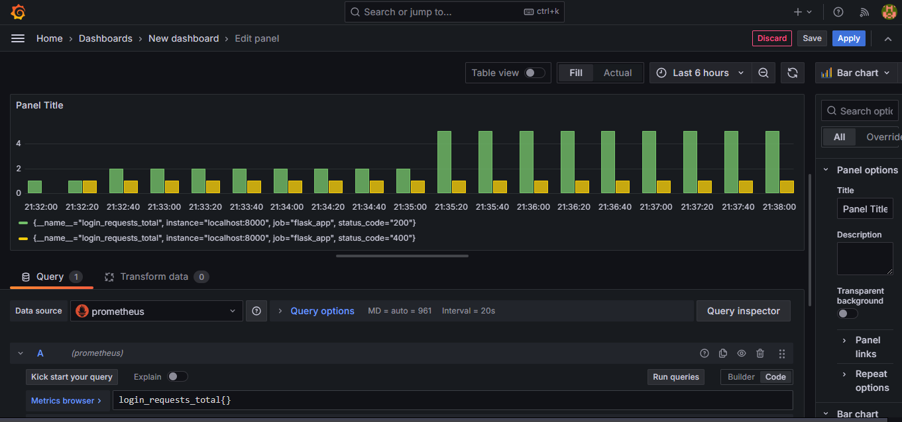
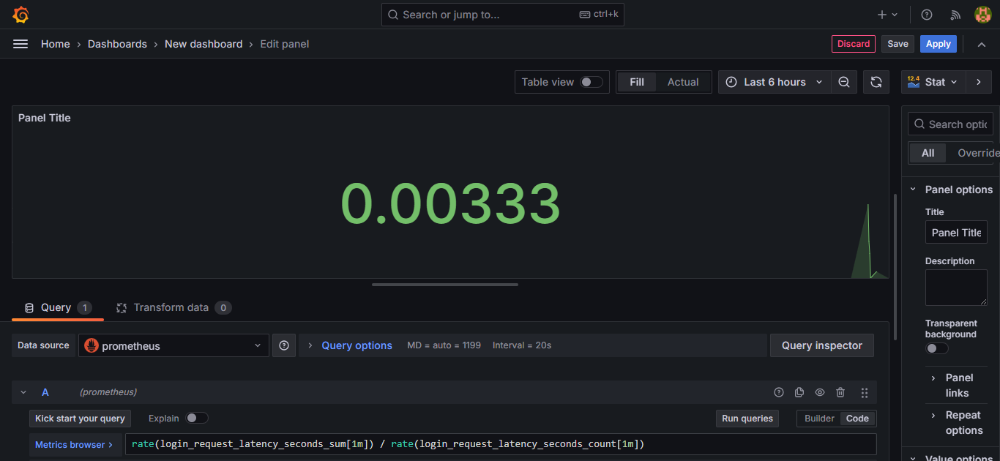
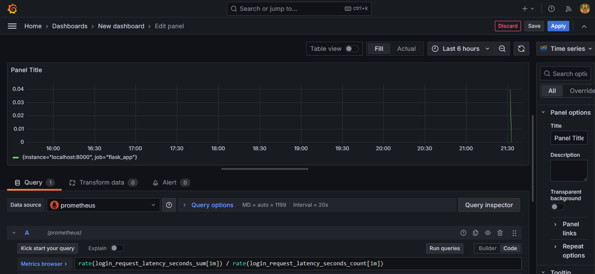

# Monitoring Flask Application Login Endpoint with Prometheus and Grafana

Prometheus actively extracts metrics from your Flask application by sending requests. It collects metrics from monitored targets by scraping HTTP endpoints at regular intervals. Grafana queries data from Prometheus and visualizes it in customizable dashboards. It supports multiple data sources, including Prometheus, allowing you to build complex and informative dashboards.

To set up monitoring for the `/login` endpoint with status codes (200, 4XX) and latency using Prometheus and Grafana in a Python Flask application, follow these comprehensive steps:

## Step-by-Step Guide

## Prerequisites

- Python installed
- `pip` package manager installed
- Prometheus installed
- Grafana installed

## Step 1: Set Up the Flask Application

### Install Required Libraries

First, ensure you have Flask and Prometheus client libraries installed:

```sh
pip install flask prometheus_client
```

### Create the Flask Application

Create a file named `app.py` and add the following code:

```python
from flask import Flask, request, jsonify
from prometheus_client import Counter, Histogram, generate_latest, start_http_server
import time

app = Flask(__name__)

# Define Prometheus metrics
REQUEST_COUNT = Counter('login_requests_total', 'Total number of login requests', ['status_code'])
REQUEST_LATENCY = Histogram('login_request_latency_seconds', 'Latency of login requests in seconds')

@app.route('/metrics')
def metrics():
    return generate_latest()

@app.route('/login', methods=['POST'])
def login():
    start_time = time.time()
    # Simulate login logic
    if request.json.get('username') == 'user' and request.json.get('password') == 'pass':
        status_code = 200
        response = jsonify(message='Login successful'), status_code
    else:
        status_code = 400
        response = jsonify(message='Invalid credentials'), status_code

    # Update Prometheus metrics
    REQUEST_COUNT.labels(status_code=status_code).inc()
    REQUEST_LATENCY.observe(time.time() - start_time)

    return response

if __name__ == '__main__':
    start_http_server(8000)  # Prometheus metrics server
    app.run(port=5000)       # Flask application server
```

### Run the Flask Application

Start your Flask application:

```sh
python app.py
```

Verify that the metrics are accessible by visiting `http://127.0.0.1:8000/metrics` in your browser. You should see Prometheus metrics.


## Step 2: Configure Prometheus

### Create Prometheus Configuration File

Create a file named `prometheus.yml` with the following content:

```yaml
global:
  scrape_interval: 15s

scrape_configs:
  - job_name: 'flask_app'
    metrics_path: '/metrics'
    static_configs:
      - targets: ['localhost:8000']
```

### Start Prometheus

Navigate to the directory containing your Prometheus binary and configuration file, then start Prometheus:

```sh
prometheus --config.file=prometheus.yml
```

Visit `http://localhost:9090/targets` to ensure your Flask application is listed as a target and is UP.

## Step 3: Generate Load to Verify Metrics

Here’s how to use Thunder Client to generate load for your `/login` endpoint:

### Install Thunder Client

1. Open Visual Studio Code.
2. Go to the Extensions view by clicking on the Extensions icon in the Activity Bar on the side of the window or by pressing `Ctrl+Shift+X`.
3. Search for "Thunder Client" and install it.

### Create HTTP Requests in Thunder Client

1. Open Thunder Client by clicking on its icon in the Activity Bar.
2. Click on the **New Request** button to create a new request.

### Successful Login Request

1. Set the request type to `POST`.
2. Enter the URL: `http://127.0.0.1:5000/login`.
3. Go to the **Body** tab, select `JSON`, and enter the following JSON data:

   ```json
   {
     "username": "user",
     "password": "pass"
   }
   ```

4. Click **Send** to execute the request.

### Failed Login Request

1. Create another new request by clicking on the **New Request** button again.
2. Set the request type to `POST`.
3. Enter the URL: `http://127.0.0.1:5000/login`.
4. Go to the **Body** tab, select `JSON`, and enter the following JSON data:

   ```json
   {
     "username": "wrong_user",
     "password": "wrong_pass"
   }
   ```

5. Click **Send** to execute the request.


## Step 4: Set Up Grafana

### Add Prometheus Data Source in Grafana

1. Open Grafana at `http://localhost:3000` and log in (default username and password are both `admin`).
2. Go to **Configuration** > **Data Sources**.
3. Click **Add data source** and select **Prometheus**.
4. Set the URL to `http://localhost:9090` and click **Save & Test**.

### Create a Dashboard in Grafana

1. Click the **+** icon in the sidebar and select **Dashboard**.
2. Click **Add new panel**.

### Add PromQL Queries

For each panel, add the following PromQL queries:

- **Total Login Requests (200):**

  ```promql
  sum(rate(login_requests_total{status_code="200"}[1m]))
  ```

  

- **Total Login Requests (4XX):**

  ```promql
  sum(rate(login_requests_total{status_code=~"4.."}[1m]))
  ```

- **Login Request Latency:**

  ```promql
  rate(login_request_latency_seconds_sum[1m]) / rate(login_request_latency_seconds_count[1m])
  ```

  
  

## Step 5: Visualize Metrics

1. Configure visualization settings (e.g., line graph, bar graph, etc.) as needed.
2. Save the dashboard for future use.

## Step 6: Verify Metrics in Grafana

Open your Grafana dashboard to see the visualized metrics for the `/login` endpoint. You should see the counts for status codes 200 and 4XX, as well as the latency of the requests.

## Conclusion

By following these steps, you will have successfully set up monitoring for the `/login` endpoint using Prometheus and Grafana, enabling you to track status codes and latency metrics effectively. This setup provides a comprehensive solution for monitoring and analyzing the performance of your Flask application's login functionality.