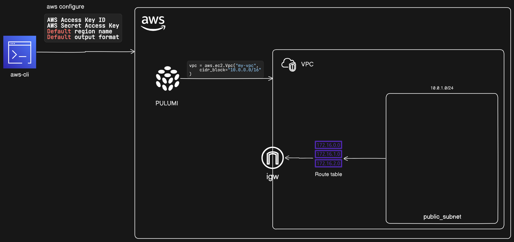

# Lab 1: Setting Up a VPC with Public Subnet, Route Table, and Internet Gateway

## Introduction

In this lab, we will set up a basic network infrastructure on AWS using a Virtual Private Cloud (VPC). The tasks include:

1. **Configuring AWS CLI and Installing Pulumi**: Set up the necessary tools to manage your AWS resources programmatically.
2. **Creating a VPC**: Establish a virtual network dedicated to your AWS account.
3. **Creating a Public Subnet**: Configure a subnet that can route traffic to and from the Internet via an Internet Gateway (IGW).
4. **Creating an Internet Gateway (IGW)**: Enable communication between instances in your VPC and the Internet.
5. **Creating a Public Route Table**: Set up a route table that routes traffic destined for the Internet to the IGW and associate it with the public subnet.



By the end of this lab, you will have a VPC with a public subnet that can communicate with the Internet. This setup forms the foundation for more complex network architectures, essential for running public-facing applications on AWS.

## Step 1: Install and Configure AWS CLI

### 1.1 Install AWS CLI

Download and install the AWS CLI by following the instructions for your operating system from the [AWS CLI installation guide](https://docs.aws.amazon.com/cli/latest/userguide/getting-started-install.html).

### 1.2 Configure AWS CLI

Open Command Prompt or PowerShell and run the following command to configure your AWS CLI with your credentials:

```sh
aws configure
```

Provide the following details when prompted:
- **AWS Access Key ID**: Your AWS access key.
- **AWS Secret Access Key**: Your AWS secret key.
- **Default region name**: The default region (e.g., `us-east-1`).
- **Default output format**: The default output format (`json`).

## Step 2: Install Pulumi

### 2.1 Install Pulumi CLI

Download and install the Pulumi CLI by following the instructions from the [Pulumi Installation Guide](https://www.pulumi.com/docs/get-started/install/).

## Step 3: Set Up a Pulumi Project

### 3.1 Create a New Directory for Your Project

Create a directory for your project and navigate into it:

```sh
mkdir my-vpc-project
cd my-vpc-project
```

### 3.2 Initialize a New Pulumi Project

Run the following command to initialize a new Pulumi project:

```sh
pulumi new aws-python
```

Follow the prompts to set up your project, including choosing a project name, description, and stack name.

## Step 4: Create the Pulumi Program

### 4.1 Open `__main__.py`

Open the `__main__.py` file in your project directory. This is where you will write the code to define your AWS infrastructure.

### 4.2 Create the VPC

Add the following code to create a VPC:

```python
import pulumi
import pulumi_aws as aws
# Create a VPC
vpc = aws.ec2.Vpc("my-vpc",
    cidr_block="10.0.0.0/16"
)
pulumi.export("vpc_id", vpc.id)
```

This code creates a VPC with the CIDR block `10.0.0.0/16` and exports its ID.

### 4.3 Create the Public Subnet

Add the following code to create a public subnet:

```python
# Create a public subnet
public_subnet = aws.ec2.Subnet("public-subnet",
    vpc_id=vpc.id,
    cidr_block="10.0.1.0/24",
    availability_zone="us-east-1a",
    map_public_ip_on_launch=True
)

pulumi.export("public_subnet_id", public_subnet.id)
```

This code creates a public subnet in the specified availability zone with the CIDR block `10.0.1.0/24`. The `map_public_ip_on_launch=True` parameter ensures that instances launched in this subnet receive a public IP address.

### 4.4 Create the Internet Gateway

Add the following code to create an Internet Gateway (IGW):

```python
# Create an Internet Gateway
igw = aws.ec2.InternetGateway("internet-gateway",
    vpc_id=vpc.id
)

pulumi.export("igw_id", igw.id)
```

This code creates an IGW and attaches it to the VPC, allowing instances in the VPC to communicate with the Internet.

### 4.5 Create the Route Table and Associate it with the Public Subnet

Add the following code to create a route table, add a route to the IGW, and associate it with the public subnet:

```python
# Create a route table
public_route_table = aws.ec2.RouteTable("public-route-table",
    vpc_id=vpc.id
)

# Create a route in the route table for the Internet Gateway
route = aws.ec2.Route("igw-route",
    route_table_id=public_route_table.id,
    destination_cidr_block="0.0.0.0/0",
    gateway_id=igw.id
)

# Associate the route table with the public subnet
route_table_association = aws.ec2.RouteTableAssociation("public-route-table-association",
    subnet_id=public_subnet.id,
    route_table_id=public_route_table.id
)

pulumi.export("public_route_table_id", public_route_table.id)
```

This code creates a route table, adds a route that directs all traffic (`0.0.0.0/0`) to the IGW, and associates the route table with the public subnet.

## Step 5: Deploy the Pulumi Stack

### 5.1 Run Pulumi Up

Deploy the stack using the following command:

```sh
pulumi up
```

Review the changes that Pulumi will make and confirm by typing "yes".

## Step 6: Verify the Deployment

### 6.1 Check the Outputs

After the deployment completes, you should see the exported VPC ID, public subnet ID, and route table ID in the output.

### 6.2 Verify in AWS Management Console

Go to the [AWS Management Console](https://aws.amazon.com/console/) and navigate to the VPC, Subnet, and Internet Gateway sections to verify that the resources have been created as expected.

## Summary

By following these steps, you will have set up a VPC with one public subnet, a public route table, and an Internet Gateway using Pulumi and AWS CLI on Windows. If you encounter any issues or need further assistance, feel free to ask!