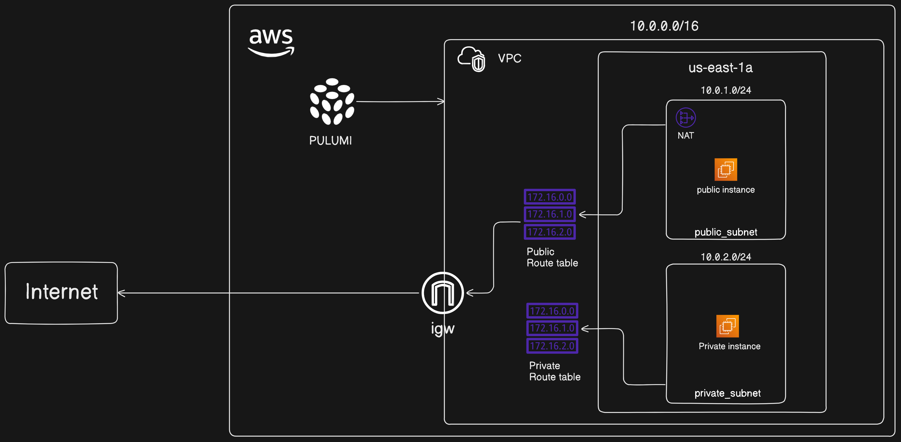

# Lab 3: Launch EC2 Instances in Public and Private Subnets

## Introduction

In this lab, you will extend your VPC setup by launching EC2 instances in both the public and private subnets. Specifically, you will:

1. **Create a VPC**: A dedicated virtual network for your AWS resources.
2. **Create a Public Subnet**: A subnet with Internet access via an Internet Gateway (IGW).
3. **Create a Private Subnet**: A subnet without direct Internet access.
4. **Set Up an Internet Gateway (IGW)**: Allow communication between the VPC and the Internet.
5. **Create Public and Private Route Tables**: Manage routing for the subnets.
6. **Create a NAT Gateway**: Enable instances in the private subnet to access the Internet securely.
7. **Launch an EC2 Instance in the Public Subnet**: Accessible from the Internet.
8. **Launch an EC2 Instance in the Private Subnet**: Accessible only from within the VPC.

By the end of this lab, you will have a fully functional VPC with EC2 instances in both the public and private subnets. The public instance will have direct Internet access, while the private instance will be isolated from direct Internet access, providing a secure environment for sensitive operations.

## Architecture Diagram

Here is a visual representation of the architecture:



## Step 1: Configure AWS CLI

1. **Configure AWS CLI**:
   - Open Command Prompt or PowerShell and run:
     ```sh
     aws configure
     ```
   - Enter your AWS Access Key ID, Secret Access Key, default region (`us-east-1`), and default output format (`json`).

## Step 2: Set Up a Pulumi Project

1. **Set Up a Pulumi Project**:
   - Create a new directory for your project and navigate into it:
     ```sh
     mkdir lab3-vpc-project
     cd lab3-vpc-project
     ```

2. **Initialize a New Pulumi Project**:
   - Run the following command to create a new Pulumi project:
     ```sh
     pulumi new aws-python
     ```
   - Follow the prompts to set up your project.

3. **Create a Key Pair**:
   - Run the following command to create a new key pair:
     ```sh
     aws ec2 create-key-pair --key-name MyKeyPair --query 'KeyMaterial' --output text > MyKeyPair.pem
     ```

4. **Set File Permissions**:
   - **For Windows**: Open PowerShell and navigate to the directory where `MyKeyPair.pem` is located. Then, use the following command to set the correct permissions:
     ```powershell
     icacls MyKeyPair.pem /inheritance:r
     icacls MyKeyPair.pem /grant:r "$($env:USERNAME):(R)"
     ```

   - **For Linux**:
     ```sh
     chmod 400 MyKeyPair.pem
     ```

## Step 3: Create the Pulumi Program

1. **Open `__main__.py`**:
   - Open the `__main__.py` file in your project directory.

2. **Create the VPC**:
   - A Virtual Private Cloud (VPC) is a virtual network dedicated to your AWS account. You can configure your VPC with a range of IP addresses, subnets, route tables, and network gateways.
   ```python
   import pulumi
   import pulumi_aws as aws

   # Create a VPC
   vpc = aws.ec2.Vpc("my-vpc",
       cidr_block="10.0.0.0/16"
   )

   pulumi.export("vpc_id", vpc.id)
   ```

3. **Create the Public Subnet**:
   - A public subnet is one that has a route to an Internet Gateway, enabling instances within it to communicate with the Internet.
   ```python
   # Create a public subnet
   public_subnet = aws.ec2.Subnet("public-subnet",
       vpc_id=vpc.id,
       cidr_block="10.0.1.0/24",
       availability_zone="us-east-1a",
       map_public_ip_on_launch=True
   )

   pulumi.export("public_subnet_id", public_subnet.id)
   ```

4. **Create the Private Subnet**:
   - A private subnet does not have a route to an Internet Gateway, preventing instances within it from directly communicating with the Internet.
   ```python
   # Create a private subnet
   private_subnet = aws.ec2.Subnet("private-subnet",
       vpc_id=vpc.id,
       cidr_block="10.0.2.0/24",
       availability_zone="us-east-1a"
   )

   pulumi.export("private_subnet_id", private_subnet.id)
   ```

5. **Create the Internet Gateway**:
   - An Internet Gateway (IGW) allows communication between instances in your VPC and the Internet.
   ```python
   # Create an Internet Gateway
   igw = aws.ec2.InternetGateway("internet-gateway",
       vpc_id=vpc.id
   )

   pulumi.export("igw_id", igw.id)
   ```

6. **Create the Public Route Table and Associate with Public Subnet**:
   - A route table contains a set of rules, called routes, that are used to determine where network traffic is directed. Here, you will create a route table, add a route to the IGW, and associate it with the public subnet.
   ```python
   # Create a route table
   public_route_table = aws.ec2.RouteTable("public-route-table",
       vpc_id=vpc.id
   )

   # Create a route in the route table for the Internet Gateway
   route = aws.ec2.Route("igw-route",
       route_table_id=public_route_table.id,
       destination_cidr_block="0.0.0.0/0",
       gateway_id=igw.id
   )

   # Associate the route table with the public subnet
   route_table_association = aws.ec2.RouteTableAssociation("public-route-table-association",
       subnet_id=public_subnet.id,
       route_table_id=public_route_table.id
   )

   pulumi.export("public_route_table_id", public_route_table.id)
   ```

7. **Create the NAT Gateway**:
   - A NAT Gateway allows instances in a private subnet to connect to the Internet or other AWS services, but prevents the Internet from initiating connections with the instances. This is necessary for updating instances in the private subnet.
   ```python
   # Allocate an Elastic IP for the NAT Gateway
   eip = aws.ec2.Eip("nat-eip", vpc=True)

   # Create the NAT Gateway
   nat_gateway = aws.ec2.NatGateway("nat-gateway",
       subnet_id=public_subnet.id,
       allocation_id=eip.id
   )

   pulumi.export("nat_gateway_id", nat_gateway.id)
   ```

8. **Create the Private Route Table and Associate with Private Subnet**:
   - The private route table directs traffic from the private subnet to the NAT Gateway for outbound Internet access.
   ```python
   # Create a route table for the private subnet
   private_route_table = aws.ec2.RouteTable("private-route-table",
       vpc_id=vpc.id
   )

   # Create a route in the route table for the NAT Gateway
   private_route = aws.ec2.Route("nat-route",
       route_table_id=private_route_table.id,
       destination_cidr_block="0.0.0.0/0",
       nat_gateway_id=nat_gateway.id
   )

   # Associate the route table with the private subnet
   private_route_table_association = aws.ec2.RouteTableAssociation("private-route-table-association",
       subnet_id=private_subnet.id,
       route_table_id=private_route_table.id
   )

   pulumi.export("private_route_table_id", private_route_table.id)
   ```

9. **Create the EC2 Instance in Public Subnet**:
   - An Amazon EC2 instance in the public subnet will have a public IP address and can directly communicate with the Internet.
   ```python
   # Create a security group for the public instance
   public_security_group = aws.ec2.SecurityGroup("public-secgrp",
       vpc_id=vpc.id,
       description='Enable HTTP and SSH access for public instance',
       ingress=[
           {'protocol': 'tcp', 'from_port': 80, 'to_port': 80, 'cidr_blocks': ['0.0.0.0/0']},
           {'protocol': 'tcp', 'from_port': 22, 'to_port': 22, 'cidr_blocks': ['0.0.0.0/0']}
       ],
       egress=[
           {'protocol': '-1', 'from_port': 0, 'to_port': 0, 'cidr_blocks': ['0.0.0.0/0']}
       ]
   )

   # Use the specified Ubuntu 24.04 LTS AMI
   ami_id = 'ami-04b70fa74e45c3917'

   # Create an EC2 instance in the public subnet
   public_instance = aws.ec2.Instance("public-instance",
       instance_type="t2.micro",
       vpc_security_group_ids=[public_security_group.id],
       ami=ami_id,
       subnet_id=public_subnet.id,
       key_name="MyKeyPair",
       associate_public_ip_address=True
   )

   pulumi.export("public_instance_id", public_instance.id)
   pulumi.export("public_instance_ip", public_instance.public_ip)
   ```

10. **Create the EC2 Instance in Private Subnet**:
    - An Amazon EC2 instance in the private subnet will not have a public IP address and cannot directly communicate with the Internet. However, it can communicate with the Internet through the NAT Gateway.
    ```python
    # Create a security group for the private instance
    private_security_group = aws.ec2.SecurityGroup("private-secgrp",
        vpc_id=vpc.id,
        description='Enable SSH access for private instance',
        ingress=[
            {'protocol': 'tcp', 'from_port': 22, 'to_port': 22, 'cidr_blocks': ['0.0.0.0/0']}
        ],
        egress=[
            {'protocol': '-1', 'from_port': 0, 'to_port': 0, 'cidr_blocks': ['0.0.0.0/0']}
        ]
    )

    # Create an EC2 instance in the private subnet
    private_instance = aws.ec2.Instance("private-instance",
        instance_type="t2.micro",
        vpc_security_group_ids=[private_security_group.id],
        ami=ami_id,
        subnet_id=private_subnet.id,
        key_name="MyKeyPair"
    )

    pulumi.export("private_instance_id", private_instance.id)
    ```

## Step 4: Deploy the Pulumi Stack

1. **Run Pulumi Up**:
   - Deploy the stack using:
     ```sh
     pulumi up
     ```
   - Review the changes and confirm by typing "yes".

## Step 5: Verify the Deployment

1. **Check the Outputs**:
   - After the deployment completes, you should see the exported VPC ID, public subnet ID, private subnet ID, NAT Gateway ID, and instance IDs in the output.

2. **Verify in AWS Management Console**:
   - Go to the [AWS Management Console](https://aws.amazon.com/console/) and navigate to the VPC, Subnet, Internet Gateway, NAT Gateway, and EC2 sections to verify that the resources have been created as expected.

## Summary

By following these steps, you will have set up a VPC with one public subnet, one private subnet, a public route table, a private route table, an Internet Gateway, and a NAT Gateway, and configured EC2 instances in both subnets using Pulumi and AWS CLI on Windows. This setup ensures that your public instance can communicate with the Internet, while your private instance remains isolated and uses the NAT Gateway for secure outbound connections. If you encounter any issues or need further assistance, feel free to ask!