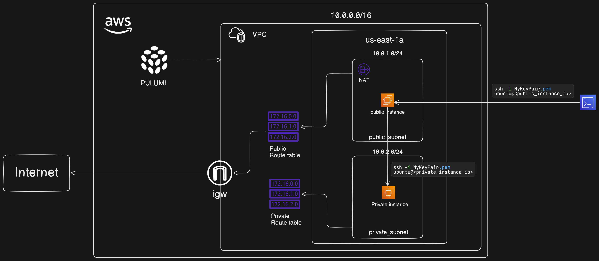

## Lab 4: SSH from Public Subnet Instance to Private Subnet Instance

### Introduction

In this lab, you will set up a Virtual Private Cloud (VPC) in AWS with both public and private subnets, launch EC2 instances in each subnet, and establish secure communication between these instances. Specifically, you will:

1. Configure AWS CLI and Pulumi.
2. Set up a VPC with a public and a private subnet.
3. Create an Internet Gateway (IGW) for the public subnet.
4. Create a NAT Gateway for the private subnet.
5. Launch an EC2 instance in the public subnet with a public IP address.
6. Launch an EC2 instance in the private subnet without a public IP address.
7. SSH into the public instance using a key pair.
8. Copy the key pair to the public instance and use it to SSH into the private instance from the public instance.

This lab provides hands-on experience with AWS networking concepts and demonstrates how to securely access resources in a private subnet through a public subnet instance.



### Step 1: Configure AWS CLI

1. **Configure AWS CLI**:
   - Open Command Prompt or PowerShell and run:
     ```sh
     aws configure
     ```
   - Enter your AWS Access Key ID, Secret Access Key, default region (`us-east-1`), and default output format (`json`).

### Step 2: Set Up a Pulumi Project

1. **Set Up a Pulumi Project**:
   - Create a new directory for your project and navigate into it:
     ```sh
     mkdir lab4-vpc-project
     cd lab4-vpc-project
     ```

2. **Initialize a New Pulumi Project**:
   - Run the following command to create a new Pulumi project:
     ```sh
     pulumi new aws-python
     ```
   - Follow the prompts to set up your project.

3. **Create a Key Pair**:
   - Run the following command to create a new key pair:
     ```sh
     aws ec2 create-key-pair --key-name MyKeyPair --query 'KeyMaterial' --output text > MyKeyPair.pem
     ```

4. **Set File Permissions**:
   - **For Windows**: Open PowerShell and navigate to the directory where `MyKeyPair.pem` is located. Then, use the following command to set the correct permissions:
     ```powershell
     icacls MyKeyPair.pem /inheritance:r
     icacls MyKeyPair.pem /grant:r "$($env:USERNAME):(R)"
     ```

   - **For Linux**:
     ```sh
     chmod 400 MyKeyPair.pem
     ```

### Step 3: Create the Pulumi Program

1. **Open `__main__.py`**:
   - Open the `__main__.py` file in your project directory.

2. **Create the VPC**:
   - Define a Virtual Private Cloud (VPC) with a specified CIDR block.
   ```python
   import pulumi
   import pulumi_aws as aws

   # Create a VPC
   vpc = aws.ec2.Vpc("my-vpc",
       cidr_block="10.0.0.0/16"
   )

   pulumi.export("vpc_id", vpc.id)
   ```

3. **Create the Public Subnet**:
   - Define a public subnet within the VPC that can launch instances with public IP addresses.
   ```python
   # Create a public subnet
   public_subnet = aws.ec2.Subnet("public-subnet",
       vpc_id=vpc.id,
       cidr_block="10.0.1.0/24",
       availability_zone="us-east-1a",
       map_public_ip_on_launch=True
   )

   pulumi.export("public_subnet_id", public_subnet.id)
   ```

4. **Create the Private Subnet**:
   - Define a private subnet within the VPC that cannot launch instances with public IP addresses.
   ```python
   # Create a private subnet
   private_subnet = aws.ec2.Subnet("private-subnet",
       vpc_id=vpc.id,
       cidr_block="10.0.2.0/24",
       availability_zone="us-east-1a"
   )

   pulumi.export("private_subnet_id", private_subnet.id)
   ```

5. **Create the Internet Gateway**:
   - Create an Internet Gateway (IGW) to allow public subnet instances to communicate with the Internet.
   ```python
   # Create an Internet Gateway
   igw = aws.ec2.InternetGateway("internet-gateway",
       vpc_id=vpc.id
   )

   pulumi.export("igw_id", igw.id)
   ```

6. **Create the Public Route Table and Associate with Public Subnet**:
   - Define a route table for the public subnet and associate it with the IGW.
   ```python
   # Create a route table for the public subnet
   public_route_table = aws.ec2.RouteTable("public-route-table",
       vpc_id=vpc.id
   )

   # Create a route in the route table for the Internet Gateway
   route = aws.ec2.Route("igw-route",
       route_table_id=public_route_table.id,
       destination_cidr_block="0.0.0.0/0",
       gateway_id=igw.id
   )

   # Associate the route table with the public subnet
   route_table_association = aws.ec2.RouteTableAssociation("public-route-table-association",
       subnet_id=public_subnet.id,
       route_table_id=public_route_table.id
   )

   pulumi.export("public_route_table_id", public_route_table.id)
   ```

7. **Create the NAT Gateway**:
   - Allocate an Elastic IP (EIP) for the NAT Gateway and create it within the public subnet to allow private subnet instances to initiate outbound communication to the Internet.
   ```python
   # Allocate an Elastic IP for the NAT Gateway
   eip = aws.ec2.Eip("nat-eip", vpc=True)

   # Create the NAT Gateway
   nat_gateway = aws.ec2.NatGateway("nat-gateway",
       subnet_id=public_subnet.id,
       allocation_id=eip.id
   )

   pulumi.export("nat_gateway_id", nat_gateway.id)
   ```

8. **Create the Private Route Table and Associate with Private Subnet**:
   - Define a route table for the private subnet and associate it with the NAT Gateway for outbound traffic.
   ```python
   # Create a route table for the private subnet
   private_route_table = aws.ec2.RouteTable("private-route-table",
       vpc_id=vpc.id
   )

   # Create a route in the route table for the NAT Gateway
   private_route = aws.ec2.Route("nat-route",
       route_table_id=private_route_table.id,
       destination_cidr_block="0.0.0.0/0",
       nat_gateway_id=nat_gateway.id
   )

   # Associate the route table with the private subnet
   private_route_table_association = aws.ec2.RouteTableAssociation("private-route-table-association",
       subnet_id=private_subnet.id,
       route_table_id=private_route_table.id
   )

   pulumi.export("private_route_table_id", private_route_table.id)
   ```

9. **Create the EC2 Instance in Public Subnet**:
   - Launch an EC2 instance in the public subnet with a public IP address, allowing SSH access from the Internet.
   ```python
   # Create a security group for the public instance
   public_security_group = aws.ec2.SecurityGroup("public-secgrp",
       vpc_id=vpc.id,
       description='Enable HTTP and SSH access for public instance',
       ingress=[
           {'protocol': 'tcp', 'from_port': 80, 'to_port': 80, 'cidr_blocks': ['0.0.0.0/0']},
           {'protocol': 'tcp', 'from_port': 22, 'to_port': 22, 'cidr_blocks': ['0.0.0.0/0']}
       ],
       egress=[
           {'protocol': '-1', 'from_port': 0, 'to_port': 0, 'cidr_blocks': ['0.0.0.0/0']}
       ]
   )

   # Use a specific Ubuntu 20.04 LTS AMI
   ami_id = 'ami-04b70fa74e45c3917'

   # Create an EC2 instance in the public subnet
   public_instance = aws.ec2.Instance("public-instance",
       instance_type="t2.micro",
       vpc_security_group_ids=[public_security_group.id],
       ami=ami_id,
       subnet_id=public_subnet.id,
       key_name="MyKeyPair",
       associate_public_ip_address=True
   )

   pulumi.export("public_instance_id", public_instance.id)
   pulumi.export("public_instance_ip", public_instance.public_ip)
   ```

10. **Create the EC2 Instance in Private Subnet**:
    - Launch an EC2 instance in the private subnet without a public IP address, relying on the NAT Gateway for Internet access.
    ```python
    # Create a security group for the private instance
    private_security_group = aws.ec2.SecurityGroup("private-secgrp",
        vpc_id=vpc.id,
        description='Enable SSH access for private instance',
        ingress=[
            {'protocol': 'tcp', 'from_port': 22, 'to_port': 22, 'cidr_blocks': ['0.0.0.0/0']}
        ],
        egress=[
            {'protocol': '-1', 'from_port': 0, 'to_port': 0, 'cidr_blocks': ['0.0.0.0/0']}
        ]
    )
        # Create an EC2 instance in the private subnet
    private_instance = aws.ec2.Instance("private-instance",
            instance_type="t2.micro",
            vpc_security_group_ids=[private_security_group.id],
            ami=ami_id,
            subnet_id=private_subnet.id,
            key_name="MyKeyPair"
        )
    pulumi.export("private_instance_id", private_instance.id)
    ```
### Step 4: Deploy the Pulumi Stack

1. **Run Pulumi Up**:
   - Deploy the stack using:
     ```sh
     pulumi up
     ```
   - Review the changes and confirm by typing "yes".

### Step 5: Access the Public Instance via SSH

1. **SSH into the Public Instance**:
   - Open a terminal and run:
     ```sh
     ssh -i MyKeyPair.pem ubuntu@<public_instance_ip>
     ```
   - Replace `<public_instance_ip>` with the public IP address of the public instance, which you can find in the Pulumi output or the AWS Management Console.

### Step 6: Copy the Key Pair to the Public Instance

1. **Copy the Key Pair to the Public Instance**:
   - On your local machine, run the following command to copy the key pair to the public instance:
     ```sh
     scp -i MyKeyPair.pem MyKeyPair.pem ubuntu@<public_instance_ip>:~
     ```
   - Replace `<public_instance_ip>` with the public IP address of the public instance.

### Step 7: SSH from the Public Instance to the Private Instance

1. **SSH into the Private Instance from the Public Instance**:
   - On the public instance, change the permissions of the copied key pair:
     ```sh
     chmod 400 MyKeyPair.pem
     ```
   - Then, SSH into the private instance:
     ```sh
     ssh -i MyKeyPair.pem ubuntu@<private_instance_ip>
     ```
   - Replace `<private_instance_ip>` with the private IP address of the private instance, which you can find in the Pulumi output or the AWS Management Console.

### Summary

By following these steps, you have set up a VPC with one public subnet and one private subnet, launched EC2 instances in both subnets, and used SSH to connect from the public subnet instance to the private subnet instance using Pulumi and AWS CLI on Windows. This lab provides a practical understanding of AWS networking and security practices. If you encounter any issues or need further assistance, feel free to ask!