# Setting Up a Secure AWS Environment with Public and Private Subnets for Flask and MySQL Instances

This document provides a step-by-step guide to set up an AWS environment with two EC2 instances: one in a public subnet running a Flask application and another in a private subnet running a MySQL database. 

## Scenario

We will create a VPC with two subnets: a public subnet for a Flask application and a private subnet for a MySQL database. The public subnet will have internet access via an IGW, and the private subnet will access the internet through a NAT Gateway. Security groups will be configured to control traffic, and connectivity will be tested by pinging the MySQL instance from the Flask instance.

## Set Up Your VPC with All configuration.

### Step 1: Create a VPC

1. **Create a VPC**:

   - Navigate to the VPC Dashboard.
   - Create a new VPC with a CIDR block of `10.0.0.0/16`.

2. **Create Subnets**:

   - Create a public subnet with a CIDR block of `10.0.1.0/24` within the VPC.
   - Create a private subnet with a CIDR block of `10.0.2.0/24` within the VPC.

   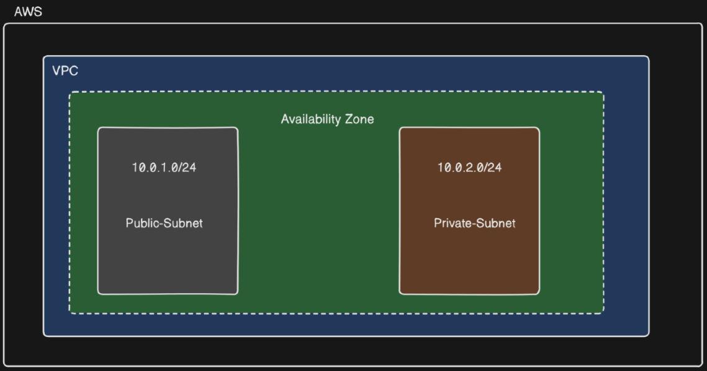

### Step 2: Set Up Route Tables

1. **Create an Internet Gateway (IGW)**:

   - Attach the IGW to your VPC.

2. **Create a Route Table for the Public Subnet**:

   - Add a route to the route table that routes all internet traffic (`0.0.0.0/0`) to the IGW.
   - Associate the route table with the public subnet.

   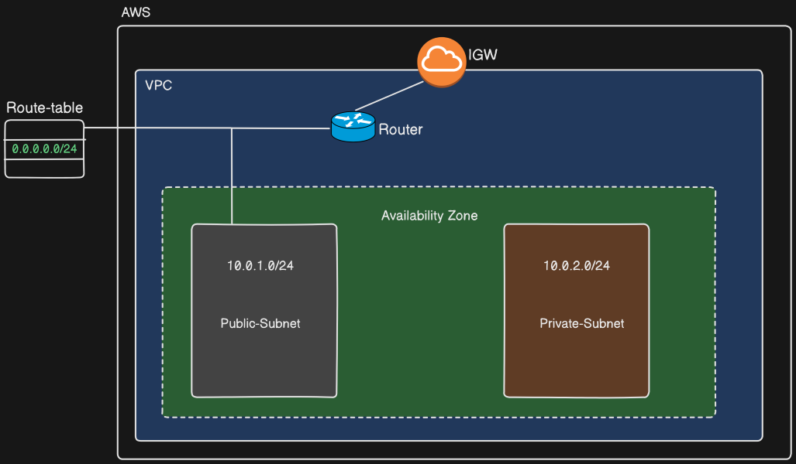

3. **Create a NAT Gateway**:

   - Create a NAT Gateway in the public subnet.
   - Allocate an Elastic IP to the NAT Gateway.

   - The NAT Gateway is necessary to allow instances in private subnets to access the internet for updates and external services without exposing them to inbound internet traffic. This  maintains security while enabling necessary outbound communication. The NAT Gateway must be created in the public subnet.

4. **Create a Route Table for the Private Subnet**:

   - Add a route to the route table that routes all internet traffic (`0.0.0.0/0`) to the NAT Gateway.
   - Associate the route table with the private subnet.

   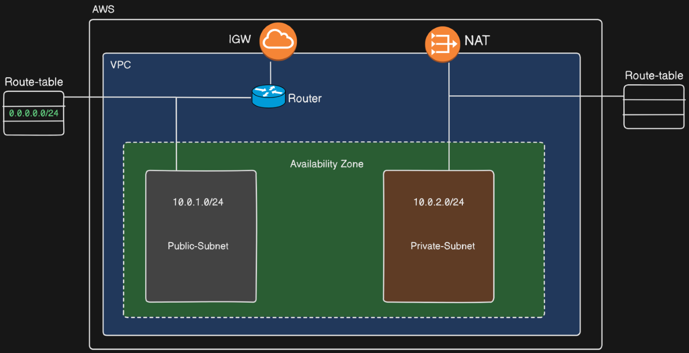

### Step 3: Launch EC2 Instances

1. **Launch an EC2 Instance in the Public Subnet**:

   - Use the Amazon Linux 2 AMI (or any other preferred AMI).
   - Choose the public subnet for the instance.
   - Ensure that the instance has an auto-assigned public IP.

2. **Launch an EC2 Instance in the Private Subnet**:

   - Use the Amazon Linux 2 AMI (or any other preferred AMI).
   - Choose the private subnet for the instance.
   - Add Endpoints for MySQL Instance in Private Subnet

     **Create VPC Endpoint**:

     - Navigate to the VPC Dashboard.
     - Create a VPC endpoint for the required AWS service.
     - Select your VPC and the private subnet where your MySQL instance resides.
     - Configure the endpoint policy.

   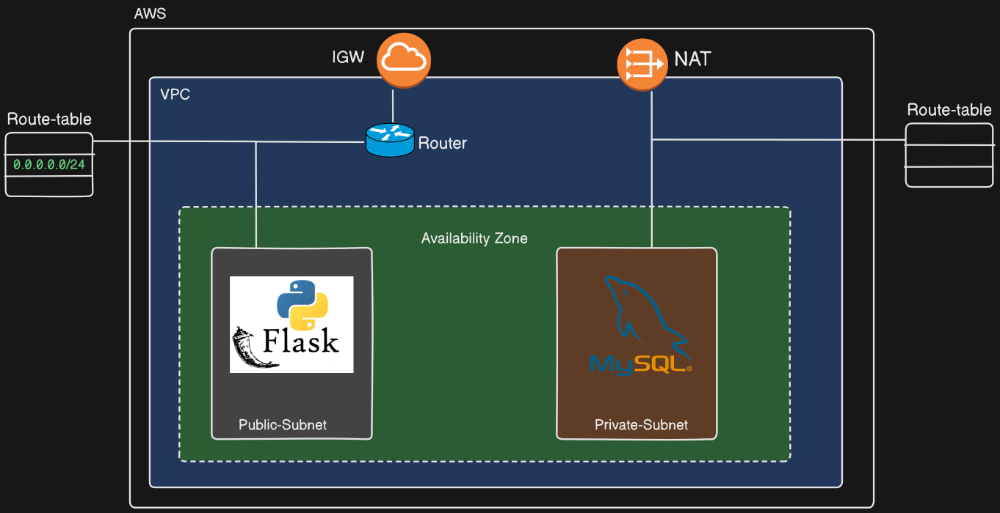

   

### Step 4: Configure Security Groups

1. **Create a Security Group for the Flask Application (Public Instance)**:

   - Allow inbound traffic on port 22 (SSH) from your IP.
   - Allow inbound traffic on all ports from any IP.

   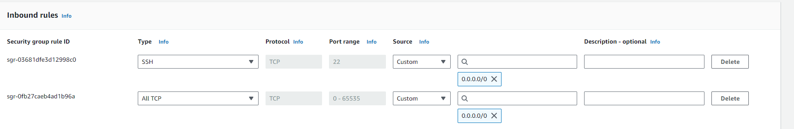

2. **Create a Security Group for the MySQL Database (Private Instance)**:

   - Allow inbound traffic on port 3306 (MySQL) from the security group of the Flask application.
   - Allow inbound traffic on port 22 (SSH) from the public subnet CIDR block.

   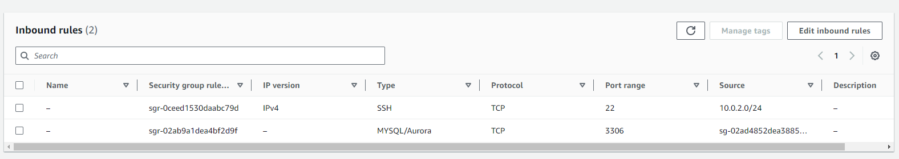

### Step 5: Verify Configuration

1. **Check Route Tables**:

   - Ensure the public subnet's route table routes traffic to the IGW.
   - Ensure the private subnet's route table routes traffic to the NAT Gateway.

   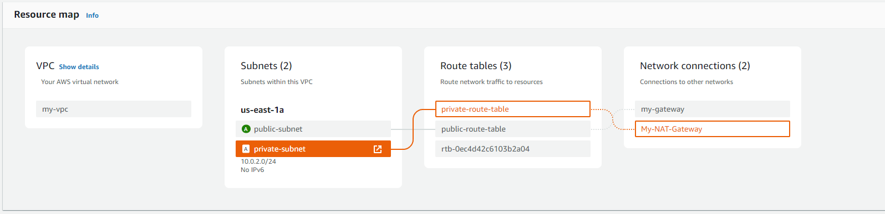
   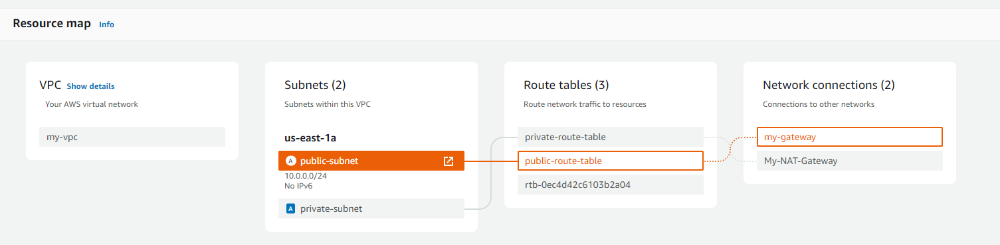

## Mysql Database Launch on Private Subnet Instance

### Step 1: Update the package list and install Docker

Install and set up the docker in ubuntu EC2 instance.

### Step 2: Create a database initialization script (init_db.sql)

   ```sql
   CREATE DATABASE IF NOT EXISTS test_db;
   USE test_db;

   CREATE TABLE IF NOT EXISTS users (
       id INT AUTO_INCREMENT PRIMARY KEY,
       name VARCHAR(50) NOT NULL,
       email VARCHAR(50) NOT NULL
   );
   ```

### Step 3: Create a docker-compose.yaml file

   ```yaml
   version: '3.8'

   services:
     db:
       image: mysql:5.7
       restart: always
       environment:
         MYSQL_ROOT_PASSWORD: root
         MYSQL_USER: newuser
         MYSQL_PASSWORD: newpass
         MYSQL_DATABASE: test_db
       volumes:
         - ./init_db.sql:/docker-entrypoint-initdb.d/init_db.sql
       ports:
         - "3306:3306"
   ```

### Step 4: Install Docker Compose

1. **Download the Docker Compose binary**:

   ```sh
   sudo yum update -y
   sudo yum install curl gnupg -y
   sudo curl -L "https://github.com/docker/compose/releases/latest/download/docker-compose-$(uname -s)-$(uname -m)" -o /usr/local/bin/docker-compose
   ```

2. **Apply executable permissions to the binary**:

   ```sh
   sudo chmod +x /usr/local/bin/docker-compose
   ```

3. **Verify the installation**:

   ```sh
   docker-compose --version
   ```


### Step 5: Build and Run Docker Containers

1. **Build and run the containers**:

   ```sh
   sudo docker-compose up --build -d
   ```
   - `-d`: Runs the containers in detached mode, meaning they run in the background.

### Step 7: Verify that the database and tables are set up correctly

1. **Install MySQL client**:

   ```sh
   sudo apt-get update
   sudo apt-get install mysql-client -y
   ```

2. **Get the MySQL Server container ID**:

   ```sh
   sudo docker ps
   ```
   - Look for the container ID of the MySQL service in the output.

3. **Get the IP address of the MySQL container**:

   ```sh
   sudo docker inspect -f '{{range .NetworkSettings.Networks}}{{.IPAddress}}{{end}}' <container_id>
   ```
   - Replace `<container_id>` with the actual container ID from the previous step.
   - Note the IP address shown in the output.

4. **Log in to MySQL**:

   ```sh
   mysql -h <container_ip> -u newuser -pnewpass test_db
   ```
   - Replace `<container_ip>` with the IP address obtained in the previous step.
   - When prompted, enter the password `newpass`.

5. **Verify the database and tables**:

   ```sql
   SHOW DATABASES;
   USE test_db;
   SHOW TABLES;
   ```

6. **Perform basic database operations**:

   ```sql
   INSERT INTO users (name, email) VALUES ('Jane Doe', 'jane@example.com');
   SELECT * FROM users;
   ```

## Flask Application Launch on Public Subnet Instance

### 1. Set Up the Flask Application

Create a new directory for your project and navigate into it:

```sh
mkdir flask_mysql_docker
cd flask_mysql_docker
```

Create a file named app.py and add the following code:

```python
from flask import Flask, jsonify, request
from flask_sqlalchemy import SQLAlchemy

app = Flask(__name__)
app.config['SQLALCHEMY_DATABASE_URI'] = 'mysql+mysqlconnector://newuser:newpass@<my-sql-instance-private-ip>/test_db'
app.config['SQLALCHEMY_TRACK_MODIFICATIONS'] = False

db = SQLAlchemy(app)

class User(db.Model):
    __tablename__ = 'users'
    id = db.Column(db.Integer, primary_key=True)
    name = db.Column(db.String(50), nullable=False)
    email = db.Column(db.String(50), nullable=False)

    def serialize(self):
        return {
            'id': self.id,
            'name': self.name,
            'email': self.email
        }

@app.route('/')
def index():
    return jsonify(message="Connected to MySQL database")

@app.route('/users', methods=['GET'])
def get_users():
    users = User.query.all()
    return jsonify([user.serialize() for user in users])

@app.route('/users/<int:user_id>', methods=['GET'])
def get_user(user_id):
    user = User.query.get(user_id)
    if user:
        return jsonify(user.serialize())
    else:
        return jsonify({"error": "User not found"}), 404

@app.route('/users', methods=['POST'])
def add_user():
    new_user_data = request.get_json()
    new_user = User(name=new_user_data['name'], email=new_user_data['email'])
    db.session.add(new_user)
    db.session.commit()
    return jsonify({"id": new_user.id}), 201

@app.route('/users/<int:user_id>', methods=['PUT'])
def update_user(user_id):
    user = User.query.get(user_id)
    if not user:
        return jsonify({"error": "User not found"}), 404
    update_data = request.get_json()
    user.name = update_data['name']
    user.email = update_data['email']
    db.session.commit()
    return jsonify({"message": "User updated successfully"})

@app.route('/users/<int:user_id>', methods=['DELETE'])
def delete_user(user_id):
    user = User.query.get(user_id)
    if not user:
        return jsonify({"error": "User not found"}), 404
    db.session.delete(user)
    db.session.commit()
    return jsonify({"message": "User deleted successfully"})

if __name__ == '__main__':
    app.run(host='0.0.0.0')
```


### 2. Create the Dockerfile

Create a file named Dockerfile and add the following content:

```Dockerfile
FROM python:3.8-slim-buster

WORKDIR /app

COPY . /app

RUN pip install --no-cache-dir Flask Flask-SQLAlchemy mysql-connector-python

EXPOSE 5000

CMD ["python", "app.py"]
```


### 3. Create the Docker Compose File

Create a file named docker-compose.yml and add the following content:

```yaml
version: '3.8'

services:
  web:
    build: .
    command: python app.py
    volumes:
      - .:/app
    ports:
      - "5000:5000"
    environment:
      FLASK_APP: app.py
      FLASK_RUN_HOST: 0.0.0.0
      DATABASE_URL: mysql+mysqlconnector://newuser:newpass@<mysql-instance-private-ip>/test_db
```

### 4. Build and Run the Docker Container

Ensure Docker and Docker Compose are installed on your EC2 instance. Then run the following commands:

```sh
docker-compose build
docker-compose up
```

This will build the Docker image and run the Flask application on port 5000.

## Test Connectivity and ICMP Allowance

1. **Test Ping from Flask Application to MySQL (Initial Test)**:

   - SSH into the EC2 instance running the Flask application in the public subnet.
   - Attempt to ping the private IP address of the MySQL instance in the private subnet using the command:

     ```bash
     ping <MySQL-Private-IP>
     ```

   - The ping will fail because the MySQL security group does not initially allow ICMP traffic.

   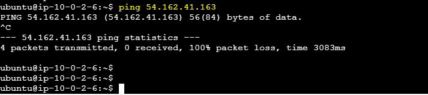


2. **Update MySQL Security Group to Allow ICMP**:

   - Navigate to the MySQL security group settings.
   - Edit the inbound rules to add an ICMP rule allowing traffic from the Flask application's security group or a specific IP range.

   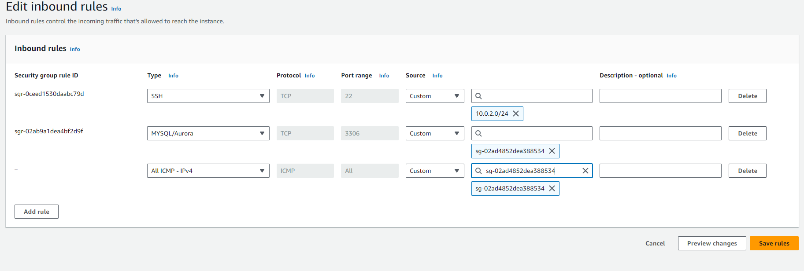

3. **Test Ping from Flask Application to MySQL (After Allowance)**:

   - SSH into the EC2 instance running the Flask application again.
   - Attempt to ping the private IP address of the MySQL instance again using the same command:

     ```bash
     ping <MySQL-Private-IP>
     ```

   - The ping should now succeed, confirming that the ICMP traffic is allowed.

   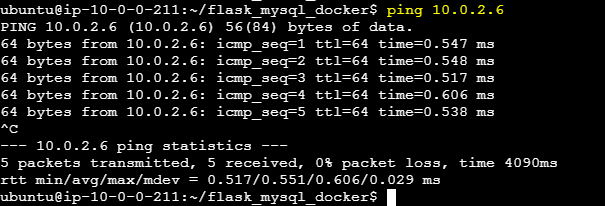

## Testing the API

1. **Check if the Flask API is running**:

   ```sh
   curl http://<flask-instance-public-IP>:5000
   ```

2. **Add a user**:

   ```sh
   curl -X POST -H "Content-Type: application/json" -d '{"name": "Fazlul Karim", "email": "fazlulkarim@gmail.com"}' http://<flask-instance-public-IP>:5000/users
   ```
   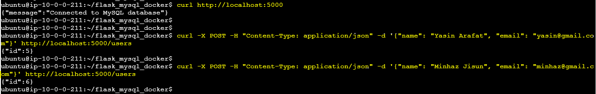

3. **Get all users**:

   ```sh
   curl http://<flask-instance-public-IP>:5000/users
   ```

   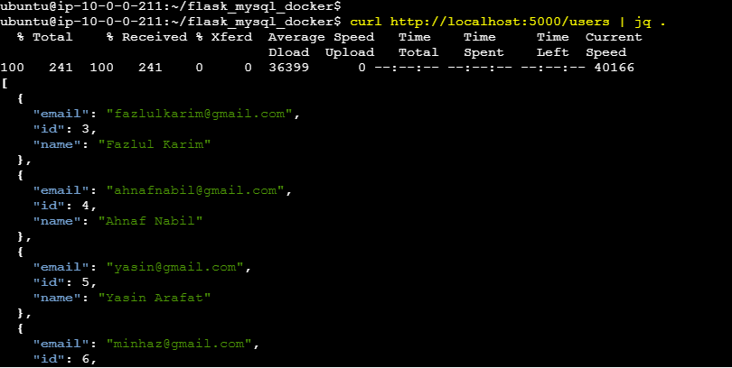

4. **Get user by ID**:

   ```sh
   curl http://<flask-instance-public-IP>:5000/users/1
   ```

5. **Update a user**:

   ```sh
   curl -X PUT -H "Content-Type: application/json" -d '{"name": "Fazlul", "email": "fazlulkarim362@gmail.com"}' http://<flask-instance-public-IP>:5000/users/1
   ```

6. **Delete a user**:

   ```sh
   curl -X DELETE http://<flask-instance-public-IP>:5000/users/4
   ```

   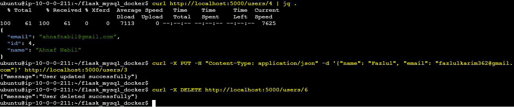

## Test Flask API from Web Browser

1. Open your web browser and enter `http://<flask-instance-public-IP>:5000`.
2. Verify the connection message confirming MySQL database access.
3. Test endpoints by accessing `http://<flask-instance-public-IP>:5000/users`.

Expected Output:

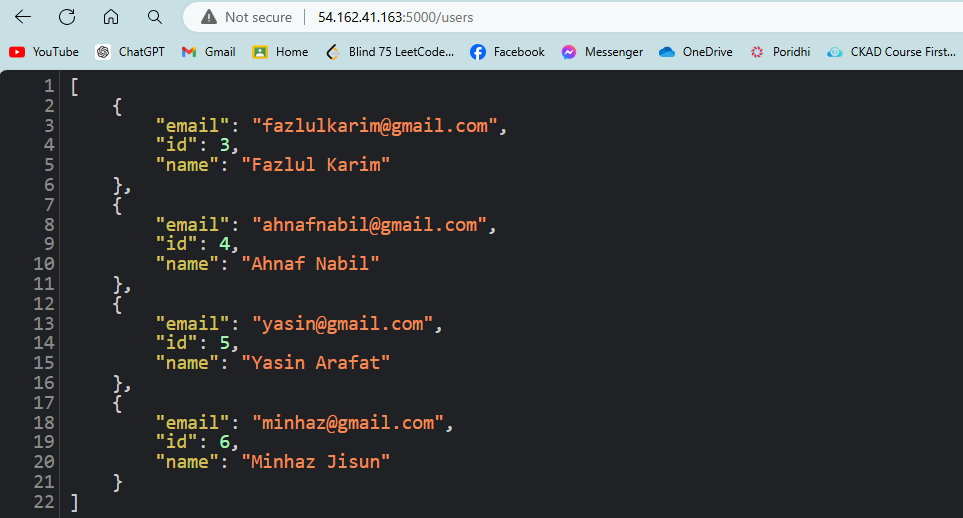

